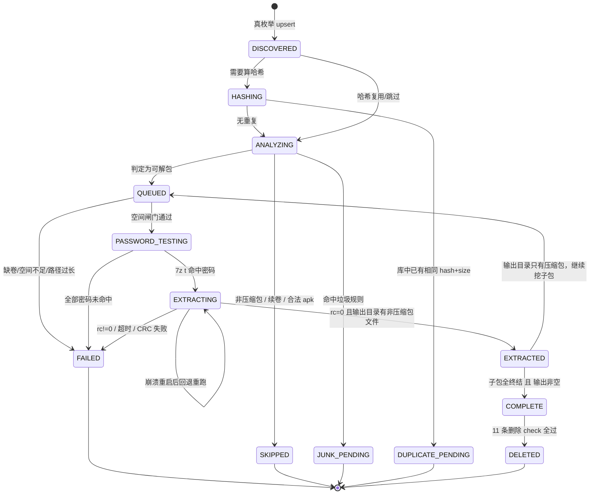
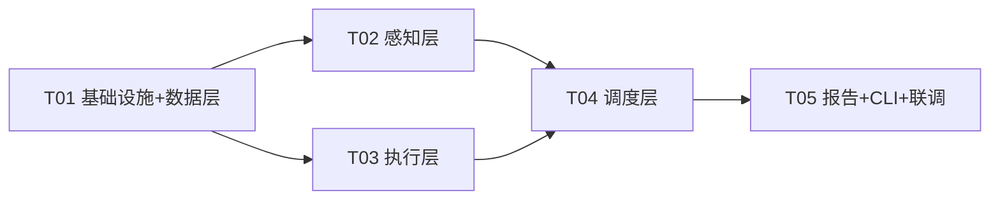

# 伪装压缩包处理工作流 v2 设计文档

| 项 | 值 |
|---|---|
| 版本 | **v2.1**（三司会审后修订稿，待审核） |
| 作者 | 高见远（架构师） |
| 日期 | 2026-09-08 |
| 状态 | **待 Ducky 审核**——本轮只出设计，不写实现代码 |
| 处理根 | `F:\BaiduNetdiskDownload\` |
| 适用对象 | ① 工程师（照着实现） ② Ducky（拍板决策，重点看 §1 / §2.7 / §4.3 / §10） |
| 上游依据 | `C:\Users\Administrator\.workbuddy\skills\laowang-unzip\SKILL.md`（v1，含 16 条关键坑） |

> **本文档与 v1 技能文档的关系**：v1 的判据（魔数表、7z 调用铁律、套娃收敛、删除纪律、回收站坑）**全部继承、不另起炉灶**。v2 只补 v1 缺的三件事：**持久化记录、串行调度、去重拦截**。

---

## 修订说明（v2.0 → v2.1）

> 来源：三司会审 `sanshi-20260908-001`（明辨诀 v3.0.2 / 破妄诀 v1.3 / 五行诀 v4.0.5，圆桌模式）。审查报告见 `docs\三司会审报告_伪装包工作流v2_2026-09-08.md`；原稿已备份为 `docs\伪装包处理工作流_v2_设计_v2.0_原稿.md`。

| # | 改动 | 落在哪 | 来源 | 严重度 |
|---|---|---|---|---|
| 1 | **父包回溯重判**：任何文件进入终结态时沿 `parent_id` 向上逐层重判 `is_fully_done()`；批次收尾再做一次全量复判兜底 | §3.3（第 8/9/10 步 + 新增 `on_terminal()`）、§3.4、§3.5、§4.1 check#5、§8 | 明辨诀 C2 | 🔴 P0 |
| 2 | **轻量头部判定前置**：去重之前先做只读 magic 判定，先把 `is_archive` 定下来再判重；并写死 `is_archive` 同值守卫的适用边界 | §3.3（第 2 步拆成 2a/2b）、§5.1、§5.5 | 明辨诀 C1 | 🔴 P0 |
| 3 | **修复产物入队**：carve 割包 / magic 修复包 / 分卷拼接包 / 改名修复包 四类产物显式入队（它们**都不在 `out_dir` 下**） | §3.3 第 8 步、§2.5 | 五行诀·知几 | 🔴 P0 |
| 4 | **空间策略修正**：删去「不删源包→双倍占用→更快撞闸门」的错误论证；新增 `PURGE_RECYCLE_ON_START/FINISH`（默认 True）；空间闸门不再把回收站计入可用 | §4.3（整节）、§3.5、附录 A、§10 Q8 | 五行·太初 + 主控裁定 | 🔴 P0 |
| 5 | **新增 §11 运行与触发**：谁来启动（推荐挂回 `laowang-unzip` 技能）+ AI 代执行授权分级表 + 可追溯性；并把低风险类由「一律待确认」改为「默认自动 + 报告告知」 | §11（新增）、§10 Q4/Q7/Q8/Q14/Q15、§6.1/§6.3、§8 | 破妄·我执 + 截面 11 | 🔴 P0 |
| 6 | 文档头：版本 v2.0 → v2.1；日期由 2026-09-06 修正为 2026-09-08 | 文档头 | 明辨诀 | 🟡 笔误 |
| 7 | 新增本「修订说明」章节 | 文档头之后 | 主控 | 🟡 |
| 8 | 看门狗判活改为**墙钟 + 进度**联合，CPU 停滞降级为辅助信号（机械盘 IO 打满时 7z CPU 也会停滞，避免误杀正在干活的大包） | §3.6 | 明辨诀 C3 | 🟡 P1 |
| 9 | §5.5 命中对象为 `DELETED` / `LOST` 时**仍置 `DUPLICATE_PENDING`**（对齐硬要求⑤） | §5.5 | 明辨诀 C4 | 🟡 P1 |
| 10 | **删除 check 新增第 12 条「无 FAILED 子包」**：父包可转 `COMPLETE`，但只要存在失败子包就**跳过删源包**（FAILED 包可能是唯一可重试线索，删了就断后路） | §4.1、§3.3 `on_terminal()` / 收尾复判 | 架构师异议 1 → 主控采纳 | 🔴 P0 |
| 11 | **去重守卫从「门槛」降为「标记」**：判重只依据 `hash` + `size_bytes` 全等、与 `is_archive` 无关；不一致时照常拦截但标「类型判定不一致，请复核」并强制「需确认」。根治头伪装包（真签名在 offset 36~几十 MB）漏拦问题 | §5.5、§5.3、§3.3 第 2a 步 | 架构师异议 2 → 主控第 4 方案 | 🔴 P0 |

> 修订：三司会审 sanshi-20260908-001，2026-09-08

---

## 1. 设计目标与新旧对比

### 1.1 一句话目标

> **v2 解决的核心问题：把「哪个包解过、哪个没解、哪个出错、哪个是重复的」从「靠人翻目录猜」变成「查数据库一句话出结果」。**
>
> 附带解决产物重复问题（同一内容被解出多份，白占几十 GB）。

### 1.2 v1 的四个病灶（对应 Ducky 本次 5 条硬要求）

| # | 病灶 | 具体表现 | v2 对策 |
|---|---|---|---|
| A | **状态不可知** | 只能靠「目录里还剩 `.zip/.7z` 就是没解完」这种**目视判据**；`docs/` 里 118 个 py + 136 个 log 各记一套，互相矛盾 | 单一 SQLite 事实源，每文件一行，状态机落库 |
| B | **已解检测误判** | 外层解开、输出目录里躺的是内层分卷 → 判成「已解」→ 内层永远挖不出来（v1 坑 15） | 判据改为「输出目录**非压缩包**文件数 == 0 → 未彻底解开」 |
| C | **删源包靠人肉确认** | 每批要人工列清单逐条确认；回收站假删又让「删了腾空间」完全失效 | 删除前置 11 条自动 check + 最小探针；空间账单独走「清回收站」 |
| D | **重复无法识别** | 同一个包改名重下、同一内容不同文件名，全都照解不误 | 哈希去重拦截，命中即暂停 + 任务末汇总给用户定夺 |

### 1.3 v1 vs v2 对比表

| 维度 | v1（现状） | v2（本设计） |
|---|---|---|
| 记录方式 | 各脚本各写 log，格式不一 | 单一 SQLite `files` 表，40+ 字段，全量落库 |
| 记录粒度 | 只记「源包」 | **每一层**都记：源包 / 解压产物 / carve 割出包 / 拼接包 / 分卷续卷 |
| 状态判据 | 目视（目录里有没有压缩包） | 数据库 `status` 枚举 + 多项布尔/枚举字段 |
| 调度 | 脚本成批跑，顺序不定 | **严格单线程主循环**，一次一个包，解完再下一个 |
| 套娃处理 | 反复 `plan`→`run` 多轮，靠人判断收敛 | 同一循环内消费新产物队列，**跑到「队列空且本轮无新增」自动收敛** |
| 断点续跑 | 靠脚本幂等 + 重扫 | 靠 `status` 恢复；`EXTRACTING` 超阈值视为崩溃残留，自动回退 |
| 删源包 | 每批人工确认 | 12 条 check 全过才删 + 最小探针；**去重待定夺的文件永不删** |
| 重复识别 | 无 | 哈希去重，命中置 `DUPLICATE_PENDING`，不解压，任务末汇总 |
| 垃圾识别 | 正则随脚本散落 | 集中 `junk_rules.py` 规则表，只标记不自动删 |
| 失败归因 | 在日志里翻 `Cannot open...` 猜 | `fail_reason` 25 个枚举 + `last_error` 原文 |
| 结束产出 | 无统一报告 | 一键从 DB 生成 Markdown 汇总报告 |

### 1.4 明确的非目标（v2 不做）

- ❌ 不动 `moxing04/05/06` 媒体库。
- ❌ 不做 GUI / Web 界面（v2 只出 CLI + 数据库 + Markdown 报告）。
- ❌ 不实现「自动破解密码」——只在密码库 + 目录名/文件名抠码范围内试。
- ❌ 不重写 v1 已有脚本（保留，见 §10 问题 6）。

---

## 2. 数据库设计

### 2.1 存储选型：SQLite（推荐）

| 候选 | 结论 | 理由 |
|---|---|---|
| **SQLite** | ✅ **选用** | 单文件、零服务、随 Python 自带（`sqlite3` 标准库）；WAL 支持「一写多读」；本流水线是**单写者**（单线程主循环），完美匹配；备份 = 复制一个文件 |
| MySQL / PostgreSQL | ❌ | 需装服务、常驻内存；本任务规模（预估 5 万 ~ 20 万行）远不到需要 C/S 的量级 |
| JSON / CSV 清单 | ❌ | 无事务，崩溃写坏；无索引，10 万行查哈希要全表扫 |
| Excel | ❌ | 行数上限、写入慢、无法原子更新 |

**并发模型**：主循环单线程 → **只有一个写连接**。报告/查询另开只读连接（WAL 下不阻塞写入）。

### 2.2 库文件位置（重要）

```
F:\BaiduNetdiskDownload\pipeline\db\archive.db       # 主库
F:\BaiduNetdiskDownload\pipeline\db\archive.db-wal   # WAL（自动生成）
F:\BaiduNetdiskDownload\pipeline\db\archive.db-shm   # SHM（自动生成）
F:\BaiduNetdiskDownload\pipeline\db\backup\archive-YYYYMMDD-HHMM.db   # 每批次开工前自动备份
```

**为什么放 `pipeline/db/` 而不是别处：**

| 位置 | 评估 |
|---|---|
| `【new】/`、`【done】/YYYY-MM-DD/` | ❌ **绝对禁止**——这两个目录是流水线的处理根，「解完即删」就发生在这里，库会被误删 |
| `docs/` | ❌ 禁止——`docs/` 已有 118 个 py / 136 个 log，是「清垃圾/清残留」高危区 |
| `F:\BaiduNetdiskDownload\pipeline\db\` | ✅ **推荐**——与代码同目录便于相对定位；**不在任何处理根内** |
| C 盘等其他盘 | ⚠️ 可选但不推荐：C 盘空间紧张，系统还原策略可能干扰 |

**代码级硬保护**（必须实现，不靠人记）：

1. `config.py` 定义 `PROTECTED_PREFIXES = [pipeline/, docs/, password.txt, moxing04/, moxing05/, moxing06/]`；删除模块删任何路径前先过白名单，命中即拒绝并写 `events.level=ERROR`。
2. 启动时校验：若 `DB_PATH` 位于任何 `PROCESS_ROOTS`（`【new】/`、`【done】/`）之下 → **直接抛异常拒绝启动**。

### 2.3 完整 DDL

```sql
-- ============================================================
-- 伪装包流水线 v2 · SQLite Schema（Python 3.13 自带 sqlite3）
-- ============================================================

PRAGMA journal_mode = WAL;      -- 写不阻塞读；崩溃安全
PRAGMA synchronous  = NORMAL;   -- WAL 下的性能/安全平衡点
PRAGMA foreign_keys = ON;
PRAGMA busy_timeout = 10000;    -- 10s：报告查询撞上写入时不报 database is locked
PRAGMA temp_store   = MEMORY;

-- ------------------------------------------------------------
-- 主表 files：每一个「经手过的文件」一行（含每一层解压产物）
-- ------------------------------------------------------------
CREATE TABLE IF NOT EXISTS files (
    -- ===== A. 身份 =====
    id                INTEGER PRIMARY KEY AUTOINCREMENT,

    -- ===== B. 位置（用户要求 1/3）=====
    path              TEXT    NOT NULL,      -- 绝对路径（唯一索引）
    dir_path          TEXT    NOT NULL,      -- 父目录绝对路径（冗余，便于按目录聚合）
    file_name         TEXT    NOT NULL,      -- 【要求①】文件名（含扩展名）
    declared_ext      TEXT,                  -- 原始声明扩展名（小写含点），如 .mp4 / .dzi删除
    normalized_path   TEXT,                  -- 改名/修复后的当前路径（未改名时 = path）

    -- ===== C. 内容特征 =====
    size_bytes        INTEGER NOT NULL DEFAULT 0,      -- 【要求②】文件大小（字节）
    hash              TEXT,                            -- 【要求④】哈希值（小写 hex，未算为 NULL）
    hash_algo         TEXT    NOT NULL DEFAULT 'MD5',   -- MD5 | SHA1 | BLAKE2B256
    hash_mode         TEXT    NOT NULL DEFAULT 'NONE',  -- FULL | PARTIAL | NONE
    hash_input_sig    TEXT,                            -- 缓存签名：size_bytes:mtime整数秒，一致则复用
    real_type         TEXT    NOT NULL DEFAULT 'UNKNOWN',
        -- 7Z|ZIP|RAR|RAR5|TAR|GZ|MP4|PNG|JPEG|EXE|APK|PDF|TXT|BIN|EMPTY|UNKNOWN
    is_archive        INTEGER NOT NULL DEFAULT 0,      -- 1 = 判定为可解压缩包（含伪装包）

    -- ===== D. 来源与层级（用户要求 5/8/9）=====
    origin            TEXT    NOT NULL DEFAULT 'DOWNLOAD',
        -- 【要求⑤】DOWNLOAD|EXTRACTED|CARVED|CONCATENATED|MAGIC_PATCHED|RENAMED
    depth             INTEGER NOT NULL DEFAULT 0,      -- 【要求⑧】第几层：0 = 原始下载，逐层 +1
    parent_id         INTEGER REFERENCES files(id) ON DELETE SET NULL,  -- 上一层文件 id（自关联）
    parent_archive    TEXT,                            -- 【要求⑨】上一层压缩包名（basename 冗余）
    root_id           INTEGER REFERENCES files(id) ON DELETE SET NULL,  -- 链条最顶层源包 id

    -- ===== E. 分卷 =====
    volume_group      TEXT,                            -- 同一分卷集分组 key；NULL = 非分卷
    volume_role       TEXT    NOT NULL DEFAULT 'NONE',  -- NONE | FIRST | CONTINUE

    -- ===== F. 解压结果（用户要求 6/7/10）=====
    is_extracted      INTEGER NOT NULL DEFAULT 0,      -- 【要求⑥】是否已解压 0/1
    password          TEXT,                            -- 【要求⑦】命中密码（明文；未命中为 NULL）
    password_source   TEXT    NOT NULL DEFAULT 'NONE',
        -- NONE|LIBRARY|DIR_NAME|FILE_NAME|BRACKET|INHERITED|MANUAL
    extract_output_dir TEXT,                           -- 解压输出目录（= <源包名>/ 同名子目录）
    extract_rc        INTEGER,                         -- 最后一次 7z 调用返回码
    extracted_files   INTEGER NOT NULL DEFAULT 0,      -- 本次解出文件总数
    non_archive_children INTEGER NOT NULL DEFAULT 0,   -- 输出目录内「非压缩包」文件数（核心判据）
    extracted_at      TEXT,                            -- 解压成功时间 ISO8601

    -- ===== G. 状态机 =====
    status            TEXT    NOT NULL DEFAULT 'DISCOVERED',  -- 见 §2.8
    fail_reason       TEXT    NOT NULL DEFAULT 'NONE',        -- 【要求⑩】见 §7（25 个枚举）
    retry_count       INTEGER NOT NULL DEFAULT 0,
    last_error        TEXT,                            -- 7z stderr 原文（截断 2000 字符）

    -- ===== H. 去重 =====
    dup_of_id         INTEGER REFERENCES files(id) ON DELETE SET NULL,  -- 与哪个已存在文件重复
    dup_group         TEXT,                            -- 重复组 key

    -- ===== I. 垃圾 =====
    is_junk           INTEGER NOT NULL DEFAULT 0,      -- 【要求⑪】是否垃圾广告文件 0/1
    junk_rule         TEXT,
        -- NULL|FILENAME_EXACT|FILENAME_PATTERN|DIR_PATTERN|ZERO_BYTE|TINY_TXT|CONTENT_KEYWORD|SYSTEM_JUNK

    -- ===== J. 删除 =====
    source_deleted    INTEGER NOT NULL DEFAULT 0,      -- 源包是否已删 0/1
    deleted_at        TEXT,
    delete_rc         INTEGER,                         -- 删除 API 返回码（0 = 成功）

    -- ===== K. 时间与备注 =====
    batch             TEXT,                            -- 批次 YYYY-MM-DD
    first_seen_at     TEXT NOT NULL DEFAULT (datetime('now','localtime')),
    updated_at        TEXT NOT NULL DEFAULT (datetime('now','localtime')),
    note              TEXT                             -- 自由备注
);
```

```sql
-- ------------------------------------------------------------
-- 审计流水 events：「每处理一个文件都要记录/更新」的证据
-- ------------------------------------------------------------
CREATE TABLE IF NOT EXISTS events (
    id          INTEGER PRIMARY KEY AUTOINCREMENT,
    file_id     INTEGER NOT NULL REFERENCES files(id) ON DELETE CASCADE,
    batch       TEXT,
    ts          TEXT NOT NULL DEFAULT (datetime('now','localtime')),
    from_status TEXT,
    to_status   TEXT,
    action      TEXT NOT NULL,
        -- DISCOVER|ANALYZE|HASH|DUP_HIT|VOLUME_CHECK|SPACE_CHECK|PW_TEST|
        -- EXTRACT|VERIFY|ENQUEUE|DELETE|PURGE|REPORT|CRASH_RECOVER
    level       TEXT NOT NULL DEFAULT 'INFO',  -- INFO | WARN | ERROR
    message     TEXT,
    duration_ms INTEGER
);
CREATE INDEX IF NOT EXISTS ix_events_file ON events(file_id, ts);
CREATE INDEX IF NOT EXISTS ix_events_batch ON events(batch);

-- ------------------------------------------------------------
-- 批次 batches：每次跑批一行，结束时写汇总
-- ------------------------------------------------------------
CREATE TABLE IF NOT EXISTS batches (
    batch            TEXT PRIMARY KEY,   -- YYYY-MM-DD
    started_at       TEXT,
    finished_at      TEXT,
    root_dir         TEXT,
    free_bytes_start INTEGER,
    free_bytes_end   INTEGER,
    n_discovered     INTEGER DEFAULT 0,
    n_extracted      INTEGER DEFAULT 0,
    n_failed         INTEGER DEFAULT 0,
    n_dup_pending    INTEGER DEFAULT 0,
    n_junk           INTEGER DEFAULT 0,
    n_deleted        INTEGER DEFAULT 0,
    bytes_deleted    INTEGER DEFAULT 0,
    status           TEXT DEFAULT 'RUNNING'   -- RUNNING | DONE | ABORTED
);

-- ------------------------------------------------------------
-- 索引（去重查询 / upsert / 待处理队列 三条主线）
-- ------------------------------------------------------------
CREATE UNIQUE INDEX IF NOT EXISTS ux_files_path
    ON files(path);                                   -- upsert 靠它：INSERT .. ON CONFLICT(path)
CREATE INDEX IF NOT EXISTS ix_files_hash
    ON files(hash, size_bytes, hash_mode)
    WHERE hash IS NOT NULL;                           -- 去重查询主索引
CREATE INDEX IF NOT EXISTS ix_files_status
    ON files(status);                                 -- 查「未处理 / 失败 / 待定夺」
CREATE INDEX IF NOT EXISTS ix_files_pending
    ON files(status)
    WHERE status IN ('DISCOVERED','QUEUED','DUPLICATE_PENDING','JUNK_PENDING');
CREATE INDEX IF NOT EXISTS ix_files_parent  ON files(parent_id);   -- 递归查子包
CREATE INDEX IF NOT EXISTS ix_files_root    ON files(root_id);     -- 按来源聚合
CREATE INDEX IF NOT EXISTS ix_files_depth   ON files(depth);
CREATE INDEX IF NOT EXISTS ix_files_batch   ON files(batch);
CREATE INDEX IF NOT EXISTS ix_files_junk    ON files(is_junk) WHERE is_junk = 1;
CREATE INDEX IF NOT EXISTS ix_files_dup     ON files(dup_of_id);
CREATE INDEX IF NOT EXISTS ix_files_volume  ON files(volume_group);
```

### 2.4 用户要求的 11 项字段 → 落点对照表

| # | 用户要求字段 | 落库字段 | 类型 | 取值 / 说明 |
|---|---|---|---|---|
| 1 | 文件名 | `file_name` | TEXT | 含扩展名的 basename |
| 2 | 文件大小 | `size_bytes` | INTEGER | 字节；0 字节文件走垃圾规则单独处理 |
| 3 | 所在路径 | `path` + `dir_path` | TEXT | `path` 唯一索引；`dir_path` 冗余便于按目录统计 |
| 4 | 文件哈希值 | `hash` + `hash_algo` + `hash_mode` | TEXT×3 | 见 §2.7 |
| 5 | 文件来源 | `origin` | TEXT | 6 枚举：DOWNLOAD / EXTRACTED / CARVED / CONCATENATED / MAGIC_PATCHED / RENAMED |
| 6 | 是否已解压 | `is_extracted` | INTEGER | 0/1；配合子包状态判断「彻底解完」 |
| 7 | 解压密码 | `password` + `password_source` | TEXT×2 | 命中即存明文；`password_source` 便于统计哪类来源最有效 |
| 8 | 当前是第几层压缩 | `depth` | INTEGER | 0 = 原始下载，逐层 +1 |
| 9 | 上一层的压缩包名称 | `parent_id` + `parent_archive` | INTEGER + TEXT | 双写，理由见 §2.5 |
| 10 | 解压失败原因 | `fail_reason` + `last_error` | TEXT×2 | 25 个枚举 + 7z 原文 |
| 11 | 是否垃圾广告文件 | `is_junk` + `junk_rule` | INTEGER + TEXT | 只标记、不自动删，见 §6 |

**架构师补充字段**（实现时必须一起建）：`id`、`real_type`、`is_archive`、`volume_group`、`volume_role`、`extract_output_dir`、`non_archive_children`、`status`、`retry_count`、`dup_of_id`、`dup_group`、`source_deleted`、`batch`、`first_seen_at`、`updated_at`、`hash_input_sig`。

### 2.5 层级建模：`depth` + `parent_id` + `parent_archive` 三件套

用户要求「当前是第几层压缩」和「上一层的压缩包名称」，用**自关联 + 冗余名称**建模：

| 字段 | 作用 | 为什么需要 |
|---|---|---|
| `depth` INTEGER | 层数，0 = 原始下载，1 = 从 0 层解出… | 用户直接要在报告里按层看；也是**防无限套娃**的闸门（见 §3.5 的 `MAX_DEPTH`） |
| `parent_id` FK → `files(id)` | 指向上一层那条记录 | ① 可递归查出「整条解压链」；② 可统计「某源包一共挖出多少层、多少个文件」；③ 删除时能沿链判断子包是否都处理完 |
| `parent_archive` TEXT | 上一层包的 **basename** 冗余 | ① 报告里要人能读懂（不用 JOIN 就能出表）；② 断点续跑时父记录可能尚未入库（子先于父被发现），`parent_id` 暂空但名字已有；③ 父记录被清理后仍保留可读线索 |

**为什么不用「只存路径字符串」**：路径会因改名/移动失效（v1 里 `.删7z→.7z`、跨目录分卷 `mv` 都是常态），纯字符串会断链。`parent_id` 是稳定引用。

**为什么不只用 `parent_id`**：报告要给 Ducky 看，JOIN 出来的 id 没人看得懂；且父行可能晚于子行入库。所以**两个都写**，由 `dao.link_parent(child_id, parent_id)` 统一维护，不允许直接 UPDATE。

**写入规则（工程师照做）**：

1. 解压成功后，对输出目录做真枚举，每个产物 `upsert` 时写：
   `depth = parent.depth + 1`、`parent_id = parent.id`、`parent_archive = parent.file_name`、`root_id = parent.root_id or parent.id`、`origin = EXTRACTED`。
2. carve 割出的包：`origin = CARVED`，`depth` 与源 mp4 相同，`parent_id` 指向源 mp4。
3. 分卷拼接出的整包：`origin = CONCATENATED`，`parent_id` 指向首卷。
4. magic 修复出的包：`origin = MAGIC_PATCHED`，`parent_id` 指向原文件。
5. 续卷（`.002`/`.z01`/`part2`）：`volume_role = CONTINUE`，`is_archive = 0`（不作为独立可解单元入队），`note = volume part of <首卷名>`，**照常落库**（用户要求「所有经手过的文件都要记」）。

**举例**（`夜.7z` 里套着 `夜(1).7z.001/.002`）：

| id | file_name | depth | parent_id | parent_archive | origin | volume_role |
|---|---|---|---|---|---|---|
| 101 | `夜.7z` | 0 | NULL | NULL | DOWNLOAD | NONE |
| 102 | `夜(1).7z.001` | 1 | 101 | `夜.7z` | EXTRACTED | FIRST |
| 103 | `夜(1).7z.002` | 1 | 101 | `夜.7z` | EXTRACTED | CONTINUE |
| 104 | `夜(1).mp4` | 2 | 102 | `夜(1).7z.001` | EXTRACTED | NONE |

> 修订：三司会审（五行诀·知几），2026-09-08。**`CARVED` / `MAGIC_PATCHED` / `CONCATENATED` / `RENAMED` 这四类 origin 在 v2.0 里只定义了枚举、没有接入队步骤** —— 而它们的产物都生成在**源包同目录**（`RENAMED` 是原地改名），**不在解压输出目录 `out_dir` 下**。v2.0 的 §3.3 第 8 步只枚举 `out_dir`，等于这四类产物**永远不会被处理**；而伪装包恰恰是这批文件的主要对象，**核心路径是断的**。
>
> v2.1 已在 §3.3 第 8b 步补上：四类修复产物统一由 `header.repair_artifacts()` 返回后显式 `upsert + enqueue`；`parent_id` 指向生成它的源包，`depth = 源包.depth + 1`。

### 2.6 索引设计说明（DDL 见 §2.3）

| 索引 | 服务的主查询 | 说明 |
|---|---|---|
| `ux_files_path`（唯一） | `INSERT ... ON CONFLICT(path) DO UPDATE` | **upsert 的地基**：所有"发现即入库"都靠它，保证重扫不重复插入 |
| `ix_files_hash(hash, size_bytes, hash_mode)` | `SELECT id FROM files WHERE hash=? AND size_bytes=? AND hash_mode=?` | 去重拦截的主查询；**必须带 `hash_mode`**，避免 FULL 与 PARTIAL 跨模式误撞 |
| `ix_files_pending`（部分索引） | 待处理队列重建 | 只对 4 个"未终结"状态建索引，索引体积小、查询快 |
| `ix_files_parent` | `WHERE parent_id = ?` 递归查子包 | 判断「某包是不是彻底解完」 |
| `ix_files_root` | `WHERE root_id = ?` | 「这个来源一共解出多少东西」 |
| `ix_files_junk`（部分索引） | 垃圾汇总报告 | 只索引 `is_junk=1` 的行 |
| `ix_files_volume` | `WHERE volume_group = ?` | 分卷集整组删 / 整组判缺卷 |

**写入性能**：单线程串行写，索引总数 11 个在 20 万行量级下每次 upsert 仍在毫秒级，可接受。若实测变慢，优先砍 `ix_files_depth` 和 `ix_files_origin`（报告用得少）。

### 2.7 哈希策略（关键取舍，请 Ducky 拍板）

#### 2.7.1 问题

46 GB 量级的文件全量哈希听起来很慢，但先算笔账：

| 项 | 数值 |
|---|---|
| MD5 CPU 吞吐（Python hashlib，现代 x64） | 约 400 ~ 600 MB/s |
| 机械硬盘**顺序读**吞吐（本环境 F 盘） | 约 120 ~ 180 MB/s（瓶颈在磁盘，不在 CPU） |
| 46 GB 全量哈希预估耗时 | 46 × 1024 ÷ 150 ≈ **314 秒 ≈ 5.2 分钟** |

**结论：全量哈希的实际成本只有几分钟，而且是在整个批次里摊薄的**（每个包解之前要读一遍，反正 7z 也要读一遍）。

#### 2.7.2 两个候选模式

| | **模式 A · 快速（采样指纹）** | **模式 B · 保守（全量哈希）** ⭐ 推荐 |
|---|---|---|
| < 1024 MB 的文件 | 全量 MD5 | 全量 MD5 |
| ≥ 1024 MB 的文件 | **采样指纹** = `size_bytes` + MD5(头部 1 MiB ‖ 中间 1 MiB ‖ 尾部 1 MiB)，标记 `hash_mode=PARTIAL` | 全量 MD5，`hash_mode=FULL` |
| 额外耗时（相对 B） | 省约 4 分钟 | — |
| 漏判风险 | **有**：头尾相同、中间不同的文件（如分卷拼接后、同名重下但内容微调）会被判为重复 | 无 |
| 误判代价 | 文件被 `DUPLICATE_PENDING` 卡住 → Ducky 每次都要人工看一眼，**比省下的 4 分钟贵得多** | — |
| 实现复杂度 | 高（要维护两套哈希 + 升级逻辑） | 低 |

**架构师推荐模式 B（全量哈希）**，理由：省下的时间是分钟级，误判带来的却是"每次任务结束都要人工定夺一批假重复"，与 Ducky 要「去重」的初衷（减少人工）正好相反。

#### 2.7.3 模式 A 若被选中，必须实现的兜底（不可省）

1. **跨模式不互撞**：查询必须带 `hash_mode` 条件，`FULL` 只跟 `FULL` 比，`PARTIAL` 只跟 `PARTIAL` 比。
2. **PARTIAL 撞上必须升级为全量确认**：命中后对该文件补算全量 MD5，改 `hash_mode=FULL`，再查一次；只有全量也相等才算真重复。
3. **同一组内至少保留一个全量基线**：重复组里最早那条记录强制升级为 FULL。
4. 升级耗时计入该文件的 `duration_ms`，超过 600 秒打 WARN。

#### 2.7.4 哈希特例（两个模式都要遵守）

| 情形 | 处理 |
|---|---|
| `size_bytes == 0` | **不参与去重**（所有空文件 MD5 都相同）；直接走 §6 垃圾规则 `ZERO_BYTE` |
| 路径已在库、`hash_input_sig` 与当前 `size:mtime` 一致 | **复用旧哈希，不重读**（断点续跑、重扫时省一大笔 IO） |
| 文件正在被写入（mtime 距今 < 60 秒） | 跳过本轮，状态保持 `DISCOVERED`，下轮再处理（避免读到下载一半的文件） |
| 读文件报 IO 错误 / 权限不足 | `hash_mode=NONE`，`fail_reason=IO_ERROR`，**不阻断**（仍可继续解压） |
| 分卷集 | **只对首卷哈希**；续卷 `hash` 留 NULL，避免同一内容被算两次 |
| carve 割出的包、拼接包、magic 修复包 | **都要哈希**（它们是要被解压的真实对象，也是去重的重点对象） |

#### 2.7.5 关键配置常量（`config.py`）

```
HASH_ALGO            = md5          # 或 sha1 / blake2b256
HASH_MODE            = FULL         # FULL | AUTO  （AUTO = 模式 A，≥1024MB 走采样）
HASH_FULL_LIMIT_MB   = 1024         # 仅 AUTO 模式生效
HASH_CHUNK_MB        = 8            # 流式读块大小
HASH_SAMPLE_MB       = 1            # 采样指纹每段的 MiB 数（仅 AUTO）
HASH_REUSE_BY_MTIME  = True         # size+mtime 未变则复用旧哈希
MTIME_FRESH_SEC      = 60           # mtime 距今小于此值视为「可能还在下载」
```

> **哈希算法选择**：MD5 足够。这里不是抗恶意碰撞场景（百度网盘资源，没有攻击者专门构造碰撞），且 MD5 比 SHA256 快约 2 倍。`hash_algo` 字段留着是为了将来能平滑切换。

### 2.8 状态机（每个文件的生命周期）

#### 2.8.1 状态枚举（14 个，完整清单）

| 状态 | 含义 | 是否终结态 | 是否可被主循环重新拾起 |
|---|---|---|---|
| `DISCOVERED` | 已枚举到、已 upsert 入库，尚未分析文件头 | 否 | ✅ |
| `ANALYZING` | 正在做文件头分析 / carve / magic 修复 | 否 | 崩溃残留时可重置为 `DISCOVERED` |
| `QUEUED` | 分析完毕，判定为可解包，等待解压 | 否 | ✅ |
| `HASHING` | 正在计算哈希 | 否 | 崩溃残留时可重置为 `DISCOVERED` |
| `DUPLICATE_PENDING` | **哈希去重命中，暂停解压，等用户定夺** | ⏸ 半终结 | ❌（本轮不再动，等用户） |
| `PASSWORD_TESTING` | 正在逐条试密码（`7z t`） | 否 | 崩溃残留时可重置为 `QUEUED` |
| `EXTRACTING` | 7z 正在解压 | 否 | 崩溃残留时按 §3.6 回退 |
| `EXTRACTED` | 解压成功（子包可能还没处理完） | 否 | ✅（检查子包 / 判断能否删源） |
| `COMPLETE` | **彻底完成**：自身已解 + 所有子包终结 + 输出目录有非压缩包文件 | ✅ | ❌ |
| `FAILED` | 失败，`fail_reason` 已填 | ✅ | ❌（除非用户手动 `--retry-failed`） |
| `SKIPPED` | 主动跳过：非压缩包 / 续卷 / 已知合法 apk / 空间闸门跳过 | ✅ | ❌ |
| `JUNK_PENDING` | 判定为垃圾广告，等用户确认是否删 | ⏸ 半终结 | ❌ |
| `DELETED` | 源包已成功删除 | ✅ | ❌ |
| `LOST` | 文件在库里但磁盘上找不到了（被外部删/移走） | ✅ | ❌ |

#### 2.8.2 状态迁移图



#### 2.8.3 落库时机（用户硬要求 2：每处理一个都要记录/更新）

**凡状态变化，必走 `dao.transition(file_id, to_status, action, message)`，该函数在一个事务里同时做两件事：**

1. `UPDATE files SET status=?, updated_at=now ...`；
2. `INSERT INTO events(file_id, batch, from_status, to_status, action, level, message, duration_ms)`。

**禁止**绕过 `transition()` 直接改 `status`。以下节点必须各有一次 `transition`（一个文件从发现到删除共 8~12 条 event）：

| 节点 | action | 同时更新的字段 |
|---|---|---|
| 枚举到 | `DISCOVER` | path/dir_path/file_name/size_bytes/declared_ext/batch/first_seen_at |
| 开始算哈希 | `HASH` | — |
| 哈希算完 | `HASH` | hash/hash_algo/hash_mode/hash_input_sig |
| 去重命中 | `DUP_HIT` | dup_of_id/dup_group（level=WARN） |
| 头分析完 | `ANALYZE` | real_type/is_archive/normalized_path/volume_role/volume_group |
| 空间闸门 | `SPACE_CHECK` | fail_reason（不通过时） |
| 试密码命中 | `PW_TEST` | password/password_source |
| 开始解压 | `EXTRACT` | extract_output_dir |
| 解压结束 | `EXTRACT` | extract_rc/extracted_at |
| 校验通过 | `VERIFY` | is_extracted=1/extracted_files/non_archive_children |
| 产物入队 | `ENQUEUE` | 子行 upsert（depth/parent_id/parent_archive） |
| 删除源包 | `DELETE` | source_deleted=1/deleted_at/delete_rc |

---

## 3. 单线程主循环设计（用户硬要求 3）

### 3.1 为什么严格禁止并发（写进代码注释，不许违反）

| 理由 | 说明 |
|---|---|
| **机械盘随机写放大** | 7z 解压是「读一处 + 写多处」。两个包同时解，磁头在两组读位置和两组写位置之间反复寻道，机械盘寻道约 10 ms 级，**并发 2 个包的总吞吐通常不到串行 1 个包的 1.2 倍**，但耗时抖动和失败率显著上升 |
| **伤硬盘** | 并发让磁头寻道次数成倍增加。Ducky 明确说过「多线程不会更快反而伤硬盘」——这条写死 |
| **7z 本身已吃满 IO** | 单个 7z 进程在机械盘上往往就能把 IO 打满（v1 实测解 46 GB 时磁盘 100%），没有余量可分给第二个 |
| **去重/状态一致性** | 串行意味着**任何时刻只有一个写者**，「库里有没有相同哈希」的判断是确定的；并发会出现两个包同时查不到、又同时解压的竞态 |
| **故障定位** | 串行时日志天然是单序列，出错一眼看出是哪个包；并发日志交错，v1 已经吃过这个亏 |

**实现硬约束（Code Review 必查）**：

- ❌ 禁止 `concurrent.futures.ThreadPoolExecutor` / `ProcessPoolExecutor`
- ❌ 禁止 `threading` / `multiprocessing` / `asyncio.gather` 并发解压
- ✅ 允许：7z 进程**内部**多线程（保持 7z 默认，不加 `-mmt=off`）——单个 7z 进程以顺序读写为主，强制单线程会显著拖慢大包
- ✅ 允许：报告生成、回收站盘点等**纯查询/清理**动作单独跑（不与解压同时）

**一句话：主循环严格串行（一次只处理一个包），7z 进程内部线程数不动。**

### 3.2 队列模型与收敛判据

**队列不是一次性建好的，而是边消费边增长**（套娃是常态）。

```
queue = deque()          # 待处理，FIFO
seen_paths = set()       # 本轮已入过队的绝对路径，防重复入队
new_this_round = 0       # 本轮新入队计数
```

**收敛判据（跑到这里才算完）**：队列空 → 做一次全目录复扫（真枚举）→ 有新增就继续消费 → 连续 **2 次**复扫无新增 → 判定收敛。

> v1 实测：09-06 批第 1 轮 50 个集合 → 复扫 72 个 → 74 个。**必须跑到「复扫后集合数不再增长」**。
> 另加硬上限 `MAX_SWEEP_ROUNDS = 10`，超过则停机告警（防无限循环）。

### 3.3 主循环伪代码（工程师照着实现）

```python
# pipeline/scheduler.py —— 全程单线程，不要加任何并发
def run_batch(root_dir, batch):
    db.begin_batch(batch, root_dir)
    queue, seen = deque(), set()

    # ---- 1. 初始真枚举（避 os.walk 幻影，用外部枚举或 \\?\ 前缀 scandir）----
    for p in fs_enum.real_list_files(root_dir):
        fid = dao.upsert_file(p, batch=batch, origin="DOWNLOAD", depth=0)
        if dao.status_of(fid) in OPEN_STATES:
            queue.append(fid); seen.add(p)

    sweep_round, idle_sweeps = 0, 0
    while True:
        if not queue:
            idle_sweeps += 1
            if idle_sweeps >= 2 or sweep_round >= MAX_SWEEP_ROUNDS:
                break                                # 收敛，结束
            sweep_round += 1
            added = resweep(root_dir, batch, queue, seen)
            idle_sweeps = 0 if added else idle_sweeps + 1
            continue

        fid = queue.popleft()
        idle_sweeps = 0
        process_one(fid, batch, queue, seen)

    # ---- 收尾：全量复判，兜住回溯遗漏的情况（修订 C2）----
    for r in dao.all_with_status("EXTRACTED", batch=batch):
        st = fs_enum.scan_output(r.extract_output_dir)
        if is_fully_done(r.id, st):
            dao.transition(r.id, "COMPLETE", "VERIFY", "收尾全量复判")
            maybe_delete_source(r.id, r, r.extract_output_dir, st)   # check#12 会拦住有 FAILED 子包的

    report.generate(batch)
    db.finish_batch(batch)
```

```python
def process_one(fid, batch, queue, seen):
    row = dao.get(fid)
    if not os.path.exists(row.path):
        dao.transition(fid, "LOST", "DISCOVER", "磁盘上已不存在"); return

    # ---- 2a. 轻量头部判定（只读文件头 magic，【不做】整文件签名扫描）----
    # 用途（第二轮修订）：不服务于去重（判重只看 hash+size，见 §5.5），
    # 而是服务于第 3 步完整分析前的早停 —— 明显非包的文件可提前 SKIPPED，
    # 并供 §6 垃圾规则与 real_type 粗分类使用
    quick = header.probe_magic_only(row.path)         # 只读前 32 KB，单次 < 1 ms
    dao.update_is_archive(fid, is_archive_type(quick.real_type))

    # ---- 2b. 哈希 + 去重拦截（用户硬要求 5，见 §5）----
    h = hasher.ensure_hash(row)                       # size+mtime 未变则复用旧值
    dao.update_hash(fid, h)
    if h.mode != "NONE" and h.value:
        dup = dao.find_by_hash(h.value, row.size_bytes, h.mode, exclude_id=fid)
        if dup:
            dao.transition(fid, "DUPLICATE_PENDING", "DUP_HIT",
                           "与 #%d %s 重复" % (dup.id, dup.path), level="WARN")
            dao.set_dup_of(fid, dup.id, dup_group=dup.dup_group or ("G%d" % dup.id))
            return                                    # ★ 不解压，继续队列里下一个

    # ---- 3. 完整文件头分析（继承 v1 全部判据；整文件签名扫描 + 7z 32 字节头解析）----
    # 注意：这一步【在去重之后】—— 被拦下的重复包不该先付整文件扫描的 IO 钱
    dao.transition(fid, "ANALYZING", "ANALYZE")
    info = header.analyze(row.path)                   # magic / 整文件扫签名 / 7z 32 字节头解析
    dao.update_analysis(fid, info)

    if junk.match(row, info):                         # §6 垃圾规则
        dao.transition(fid, "JUNK_PENDING", "ANALYZE", "命中垃圾规则 " + info.junk_rule)
        return
    if not info.is_archive or info.volume_role == "CONTINUE":
        dao.transition(fid, "SKIPPED", "ANALYZE", info.skip_reason); return

    # ---- 4. 预检：分卷齐不齐 + 空间闸门 ----
    ok, reason = precheck(fid, row, info)
    if not ok:
        dao.transition(fid, "FAILED", "SPACE_CHECK", reason, fail_reason=reason); return

    # ---- 5. 试密码：只用 7z t，绝不用 7z l（v1 坑 14）----
    dao.transition(fid, "PASSWORD_TESTING", "PW_TEST")
    hit = sz.test_passwords(row.path, candidates_for(row))   # 每条密码都带 -p，stdin=DEVNULL
    if not hit:
        dao.transition(fid, "FAILED", "PW_TEST", "密码未命中",
                       fail_reason=classify_no_password(row, info)); return
    dao.set_password(fid, hit.password, hit.source)

    # ---- 6. 解压（单线程，带看门狗）----
    out_dir = os.path.join(row.dir_path, stem_of(row.file_name))
    dao.transition(fid, "EXTRACTING", "EXTRACT", out_dir)
    res = sz.extract(row.path, out_dir, hit.password)        # 7z x -y -p<pwd>
    dao.set_extract_rc(fid, res.rc)

    # ---- 7. 校验：只看 rc + 输出目录非压缩包文件数 ----
    stat = fs_enum.scan_output(out_dir)
    if res.rc != 0:
        dao.transition(fid, "FAILED", "VERIFY", res.tail,
                       fail_reason=classify_extract_fail(row, res)); return
    if stat.zero_byte_files > 0:
        dao.transition(fid, "FAILED", "VERIFY", "输出目录存在 0 字节残根，疑似写满",
                       fail_reason="OUTPUT_ZERO_ROOTS"); return
    dao.set_verified(fid, stat.total, stat.non_archive)
    dao.transition(fid, "EXTRACTED", "VERIFY")

    # ---- 8. 产物入队（修订 C3：入队来源 = out_dir 产物 + 四类修复产物）----

    # 8a. 解压输出目录里的产物（含套娃子包，在同一循环里继续消费）
    for p in fs_enum.real_list_files(out_dir):
        cid = dao.upsert_file(p, batch=batch, origin="EXTRACTED",
                              depth=row.depth + 1, parent_id=fid,
                              parent_archive=row.file_name)
        enqueue(cid, p, queue, seen)

    # 8b. ★ 四类「修复产物」必须单独入队 —— 它们【都不在 out_dir 下】，
    #     而伪装包恰恰是这批文件的主要对象，漏了等于核心路径断了
    #     ┌────────────────┬──────────────────────────────┬────────────────────┐
    #     │ origin         │ 是什么                        │ 生成在哪个目录      │
    #     ├────────────────┼──────────────────────────────┼────────────────────┤
    #     │ CARVED         │ 假 mp4/假图 头剥离后割出的包   │ 源包同目录          │
    #     │ MAGIC_PATCHED  │ UA→PK 等 magic 修复后的包      │ 源包同目录          │
    #     │ CONCATENATED   │ 4GB 切断 / 风景01+02 拼接整包  │ 源包同目录          │
    #     │ RENAMED        │ 首卷后缀被加「删」字的改名修复  │ 原地改名，即产物    │
    #     └────────────────┴──────────────────────────────┴────────────────────┘
    #     四者一律：parent_id = 生成它的源包 id，depth = 源包.depth + 1
    for art in header.repair_artifacts(row, info):    # art = (path, origin_kind)
        cid = dao.upsert_file(art.path, batch=batch, origin=art.origin_kind,
                              depth=row.depth + 1, parent_id=fid,
                              parent_archive=row.file_name)
        enqueue(cid, art.path, queue, seen)

    # ---- 9. 解完即删（用户硬要求 4，见 §4）----
    stat = fs_enum.scan_output(out_dir)               # 子包刚入队，此刻多数还没解
    maybe_delete_source(fid, row, out_dir, stat)      # 判不过就不删，等回溯

    # ---- 10. 彻底完成判定 + 向上回溯（修订 C2）----
    if is_fully_done(fid, stat):
        dao.transition(fid, "COMPLETE", "VERIFY")     # 内部会自动调 on_terminal()
    on_terminal(fid)    # ★ 无论自己是否 COMPLETE，都沿 parent_id 向上逐层重判祖先
```

```python
# ================= 终结态回溯重判（修订 C2，2026-09-08）=================
# 为什么必须有它：
#   父包在上面第 8 步把子包入队后立刻就出队了，主循环【再也不会回来看它】。
#   而那一刻子包刚入队、还没进终结态，所以就地判 is_fully_done() 必然是 False
#   -> 父包永远停在 EXTRACTED -> §4.1 check#5「子包全终结」永远不过
#   -> 用户硬要求④「解完即删」本轮根本不会触发，源包会一直堆着。
#
# 触发方式（两处，缺一不可）：
#   ① dao.transition() 内部：当 to_status 属于 TERMINAL_STATES 时自动调 on_terminal(fid)
#      （这样 FAILED / SKIPPED / DELETED 等非成功终结也会触发回溯，
#        父包不会因为某个子包永久失败而永远卡在 EXTRACTED）
#   ② 批次收尾：对所有 status=EXTRACTED 再跑一次全量复判（见 run_batch）
def on_terminal(fid):
    cur = dao.get(fid).parent_id
    while cur is not None:
        p = dao.get(cur)
        if p.status not in TERMINAL_STATES:
            st = fs_enum.scan_output(p.extract_output_dir)
            if is_fully_done(cur, st):
                dao.transition(cur, "COMPLETE", "VERIFY", "回溯重判：子包已全终结")
                # 仅当 §4.1 check 1-12 全过才删；其中 check#12「无 FAILED 子包」
                # 会拦下「里面还锁着 / 还损坏一个子包」的父包 —— 源包保留以备重试
                maybe_delete_source(cur, p, p.extract_output_dir, st)
        cur = p.parent_id

def enqueue(cid, path, queue, seen):
    if path not in seen:
        seen.add(path); queue.append(cid)
```

### 3.4 断点续跑（进程被杀/崩溃/断电后重跑）

**核心原则：重启后不重复解、不漏解。靠 `status` 而不是靠内存队列。**

**启动时的状态定正（`recover.py`）：**

| 库中状态 | 重启后处理 | 理由 |
|---|---|---|
| `EXTRACTING` | **回退为 `EXTRACTED` 的处理前状态**：先检查输出目录——若 `non_archive_children > 0` 且无 0 字节残根，视为解压已完成 → 直接进 `EXTRACTED`；否则回退 `QUEUED` 重解 | 崩溃点可能在解压前/中/后，用磁盘事实校正 |
| `PASSWORD_TESTING` / `ANALYZING` / `HASHING` | 回退到 `QUEUED` / `DISCOVERED` | 这三个动作都幂等，重做无副作用 |
| `EXTRACTED`（非终结） | 重新扫描输出目录，更新 `extracted_files` / `non_archive_children`，继续挖子包；**并对本批所有 `EXTRACTED` 记录跑一次全量复判（同 §3.3 收尾）** | 子包可能没处理完；崩溃前可能刚好漏了回溯（修订 C2） |
| `COMPLETE` / `FAILED` / `SKIPPED` / `DELETED` / `LOST` | **不动**（除非用户显式 `--retry-failed`） | 终结态 |
| `DUPLICATE_PENDING` / `JUNK_PENDING` | **不动**，等用户定夺 | 用户硬要求 5 |
| 库里有、磁盘上没有了 | 置 `LOST`，记一条 WARN | 可能被外部删了 |

**防重复解的三道保险**：

1. `ux_files_path` 唯一索引 + `ON CONFLICT(path) DO UPDATE` → 重扫不会插入重复行。
2. 只有 `status IN (DISCOVERED, QUEUED)` 才入队（`OPEN_STATES`），已解/已失败的直接跳过。
3. `is_extracted=1` 且输出目录已存在且 `non_archive_children>0` 的包，即使被强制入队，`precheck` 也会判「已解」并跳过。

**防漏解**：复扫机制（§3.2）——每个批次结束前至少做 2 次全目录真枚举复扫，比对库里 `path` 集合，磁盘有而库里没有的统统补录入队。

### 3.5 关键判据（写死成常量，不许拍脑袋）

```python
# 判「是否已彻底解开」（v1 坑 15：光看"输出目录有文件"会误判）
def is_fully_done(fid, stat) -> bool:
    if stat.non_archive_children == 0:
        return False            # ★ 输出目录里只剩压缩包/空 = 没彻底解开，继续挖
    kids = dao.children_of(fid)
    return all(k.status in TERMINAL_STATES for k in kids)

# 判「是否需要重解」
def needs_extract(row) -> bool:
    return row.status in ("DISCOVERED", "QUEUED") and row.is_archive == 1

# 防无限套娃
MAX_DEPTH = 8                   # depth >= 8 的新产物一律 SKIPPED + 告警，不再解
MAX_SWEEP_ROUNDS = 10           # 复扫轮次上限
```

> 修订：三司会审 C2，2026-09-08
>
> **为什么 `is_fully_done()` 必须靠「回溯」触发，而不能只在 `process_one()` 末尾就地判一次**：父包在 §3.3 第 8 步把子包入队后就**立刻出队**了，主循环再也不会回来看它。而那一刻子包刚入队、还没进终结态，就地判 `is_fully_done()` 必然返回 `False` —— 父包会**永远停在 `EXTRACTED`**，§4.1 删除 check#5「子包全终结」**永远不过**，用户硬要求④「解完即删」**本轮根本不会触发**，源包一直堆着。
>
> 因此 v2.1 补两道：① 任何文件进入终结态 → `on_terminal(fid)` 沿 `parent_id` 逐层向上重判祖先；② 批次收尾对所有 `EXTRACTED` 做一次全量复判兜底。
```

**空间闸门公式**（v1 实测经验值，写死）：

```
need_bytes = ceil(输入总字节 * 1.5) + 6 GiB
    输入总字节 = 单包自身大小；分卷集 = 该组所有卷大小之和
free_bytes = shutil.disk_usage(输出盘).free      # ★ 不含回收站可回收量（修订，见下表）
放行条件：free_bytes >= need_bytes
```

| 情形 | 动作 |
|---|---|
| `free >= need` | 放行 |
| `free < need` | **先清一次回收站**（默认自动，`PURGE_RECYCLE_ON_START/FINISH`，见 §4.3）→ 用**实测三路读数**重算 `free` → 仍 `>= need` 则放行 |
| 清完仍不足 | `fail_reason = DISK_GUARD_SKIP`，`SKIPPED`，**继续处理队列下一个，不停机** |
| 任意时刻 `free < 20 GiB`（绝对下限 `MIN_FREE_BYTES`） | **立即停机**，写 `batches.status=ABORTED`，保留现场等用户处理 |

> 修订：三司会审（五行诀·太初 + 主控裁定 sanshi-20260908-001），2026-09-08
> **`free_bytes` 不再把「回收站可回收量」计入可用。** 旧设计隐含假设「删源包能腾空间」，但本环境删除**全部**进 `F:/$RECYCLE.BIN`、字节仍在 F 盘（v1 实测删 31.5 GB 后剩余纹丝不动），运行期删源包一点没少占 —— 那个假设不成立。

> ⚠️ **别被读数骗**：v1 实测删完 31.5 GB 后 F 盘剩余纹丝不动（进回收站了）。**空间闸门必须用"删后复核"的读数**，且每次删完源包都重新测一次 `shutil.disk_usage`。**注意：删源包不会让这个数变大**（进回收站），它只会因为「清回收站」而变大 —— 这正是 v2.1 把清回收站改为默认开启的原因。

### 3.6 超时与卡死防护

**7z 调用硬性参数（v1 铁律，逐条照抄）**：

```
7z x -y -p<密码> <arc> -o<out>
  stdin            = subprocess.DEVNULL     # ★ 绝不能省：加密包会读 stdin 等密码，0 CPU 永久挂死
  creationflags    = 0x08000000             # CREATE_NO_WINDOW
  timeout          = 5400                   # 90 分钟；单包上限
7z t -p<密码> <arc>                          # 判密码对不对，只看 rc==0 且输出含 Everything is Ok
```

| 风险 | 判据 | 处置 |
|---|---|---|
| **无 `-p` 试解挂死** | 进程存在、进度签名零增长、CPU 时间也是 0（曾卡 27 分钟零产出） | **预防**：每条密码必带 `-p` + `stdin=DEVNULL`；**检测**：进度签名连续 1800 秒（30 分钟）零增长 → 判死。CPU 停滞只写 `events` 作佐证，**不单独用于判死** |
| **超时** | 墙钟 > 5400 秒 | `kill` 进程树 → `fail_reason=TIMEOUT` → `retry_count += 1`，最多重试 1 次 |
| **CPU 停滞但在正常干活** | 机械盘 IO 打满时，7z 的 CPU 时间也可能长时间不涨 | **不干预**（修订 C3：这是旧设计最大的误杀来源）。只有「墙钟 > 5400 秒」和「进度 1800 秒零增长」两个条件才会杀 |
| **进度签名怎么算** | `progress_signature(out_dir)` = (输出目录文件数, 目录内总字节数 // 64 MiB) | 每 30 秒采一次；元组不变即「本轮无进展」。**不能只看单个输出文件的大小** —— 7z 写盘预分配会让它一上来就是满大小（v1 坑 15） |
| **看门狗采样** | 用 `psutil`；无依赖时用 `ctypes` + `GetProcessTimes`，或 `tasklist` 粗判 | 采样开销 < 1 ms，不影响性能 |

**看门狗伪代码**：

```python
def run_7z(args, out_dir, timeout=S7Z_TIMEOUT_SEC, progress_idle_sec=PROGRESS_IDLE_SEC):
    # 修订 C3：墙钟 + 进度 联合判活；CPU 停滞只作辅助信号，不再单独用于判死
    p = subprocess.Popen(args, stdin=DEVNULL, stdout=PIPE, stderr=PIPE,
                         creationflags=0x08000000)
    t0 = time.time()
    last_sig, idle, last_cpu = progress_signature(out_dir), 0.0, 0.0
    while p.poll() is None:
        # 主判据①：墙钟硬上限
        if time.time() - t0 > timeout:
            kill_tree(p.pid)
            return Result(rc=-15, killed=True, reason="TIMEOUT")
        # 主判据②：进度签名（输出目录文件数 + 目录内总字节数的粗粒度组合）
        sig = progress_signature(out_dir)
        idle = idle + POLL_INTERVAL if sig == last_sig else 0.0
        last_sig = sig
        if idle >= progress_idle_sec:
            kill_tree(p.pid)
            return Result(rc=-9, killed=True, reason="HANG_NO_PROGRESS")
        # 辅助信号：CPU 时间只记录，不单独判死（机械盘 IO 打满时 7z CPU 也会停滞）
        last_cpu = process_cpu_time(p.pid)
        time.sleep(POLL_INTERVAL)                      # 30 秒
    return Result(rc=p.returncode, out=p.stdout.read(), err=p.stderr.read())

def progress_signature(out_dir):
    # 不看单个输出文件的大小 —— 7z 写盘会预分配，一上来就是满大小（v1 坑 15）
    n, total = 0, 0
    for f in fs_enum.real_list_files(out_dir):
        try:
            total += os.path.getsize(f); n += 1
        except OSError:
            pass
    return (n, total // (64 * 1024 * 1024))            # 文件数 + 总字节/64MiB
```

> `POLL_INTERVAL = 30`，`PROGRESS_IDLE_SEC = 1800`，`S7Z_TIMEOUT_SEC = 5400`。
>
> 修订：三司会审 C3，2026-09-08。旧设计用「CPU 150 秒零增长」判挂死，**在机械盘上是错的** —— IO 打满时 7z 的 CPU 时间也会停滞，会把**正在干活**的大包当死进程杀掉（Pre-Mortem 里排第 2 的失败原因）。改为**墙钟 + 进度**联合判活，CPU 时间降级为辅助信号。

---

## 4. 解完即删的判定与执行（用户硬要求 4）

### 4.1 允许删除的 12 条 check（逐条全过才删，缺一不可）

`maybe_delete_source()` 内部按序执行，**任何一条不过就跳过删除**（源包保留、状态停在 `COMPLETE`，报告里标「待手动清理」）：

| # | Check | 判据 | 不过时的动作 |
|---|---|---|---|
| 1 | 7z 返回码 | `res.rc == 0` | 不过 → 已在 §3.3 第 7 步进 `FAILED` |
| 2 | 输出目录存在 | `os.path.isdir(out_dir)` | `fail_reason = OUTPUT_MISSING` |
| 3 | **输出目录有实质内容** | `stat.non_archive_children >= 1` | 判「未彻底解开」，转去挖子包，**不删** |
| 4 | 无 0 字节残根 | `stat.zero_byte_files == 0` | `fail_reason = OUTPUT_ZERO_ROOTS`（曾因写满盘留下大量 0 字节残根） |
| 5 | 子包全终结 | `all(k.status in TERMINAL_STATES for k in children)` | 还有子包没解完 → 等子包。**关键：父包出队后主循环不再拾起它，check#5 只会因为 §3.3 的「终结态回溯重判 / 收尾全量复判」而变绿**（修订 C2）。另：若子包里有 `FAILED`，父包可转 `COMPLETE` 但**不删源包**（架构师补充，避免连带删掉还锁着/还损坏的线索） |
| 6 | 产物已全部入库 | 输出目录真枚举数 == 库里 `parent_id=fid` 的行数 | 重新枚举补录，仍不一致则不删 |
| 7 | 数据库已落成功状态 | `status == COMPLETE` 且事务已提交 | 先提交事务再删 |
| 8 | 非去重待定夺 | `status != DUPLICATE_PENDING` | **永不删**（用户硬要求 5） |
| 9 | 非垃圾待定夺 | `status != JUNK_PENDING` | 等用户确认 |
| 10 | carve 场景的 carved 包有效 | `7z l <carved>` 返回 `VALID`（v1 坑 11）；`ENCRYPTED` / `INVALID` 时**源 mp4 和 carved 包都保留** | 保留待人工 |
| 11 | 路径不在保护白名单 | 不在 `PROTECTED_PREFIXES` 内 | 拒绝并记 `events.level=ERROR` |
| 12 | **无 FAILED 子包**（第二轮修订新增） | `children 中 status=FAILED 的数量 == 0` | 父包**仍转 `COMPLETE`**，但**跳过删除**：报告「待手动清理」单列，注明「存在失败子包，保留源包以备重试」—— FAILED 包可能是唯一还能重试的线索，删了就断了后路 |

**额外规则**：

- **分卷集整组删**：同一 `volume_group` 的所有卷（首卷 + 续卷）要么一起删，要么一个都不删。不允许只删首卷留下续卷。
- **头伪装场景**：假 `.mp4` 和从它割出的 `.zip` **都算源**，两个一起删（前提第 10 条通过）。
- **最小探针**：每个批次**第一次**执行删除前，先删 1 个（挑体积最小的源包），用真枚举验证它确实没了；探针失败 → **整个批次停止删除**，告警。v1 铁律，不许省。
- **密码锁死的包永不删**：`fail_reason` 属于密码类的一律保留（当前有 4 个这类包，合计约 1.4 GB）。

### 4.2 删除执行方式

**绝不用** `os.remove` / `shutil.rmtree` / `Remove-Item` 批量（v1 实测：走安全钩子会假删；一次性 ≥50 个会被 `BULK_CONFIRM_REQUIRED` 拦，第 50 个起真没删）。

**用底层 API（推荐 ctypes，纯 Python 无外部依赖）：**

```python
import ctypes

def force_delete_file(abs_path: str) -> int:
    p = to_extended(abs_path)              # 加 \\?\ 前缀，破 260 字符限制
    ctypes.windll.kernel32.SetFileAttributesW(p, 0x80)  # NORMAL，清只读/系统/隐藏
    ok = ctypes.windll.kernel32.DeleteFileW(p)          # 返回 0 表示失败
    return 0 if ok else ctypes.windll.kernel32.GetLastError()
```

| 要点 | 说明 |
|---|---|
| **路径前缀** | 一律转 `\\?\F:\...` 扩展长度形式；Windows 260 字符限制是常态（深层套娃 + 中文长名） |
| **清属性** | 先 `SetFileAttributesW(p, 0x80)`（NORMAL）再删，否则只读/系统/隐藏文件删不掉（`.DS_Store`、回收站里的 `$R*` 都是） |
| **验证** | 删完**必须**真枚举或 `os.path.exists` 复核一次；`DeleteFileW` 返回非 0 才算成功 |
| **落地方式** | 删逻辑写进 `.py` 脚本文件里跑，**不要**在命令行拼外部删命令 |
| **频率** | 解完一个就删一个（用户硬要求 4：不要堆积），不是攒一批 |
| **记录** | 每次删除写一条 `events(action=DELETE)`，`delete_rc` 存返回码 |

**返回值处理**：`DeleteFileW` 返回 0 = 失败，取 `GetLastError()`：

| GetLastError | 含义 | 处置 |
|---|---|---|
| 2 / 3 | 文件不存在 / 路径不存在 | 视为已删，置 `source_deleted=1`，记 INFO |
| 5 | 拒绝访问（权限/被占用） | `delete_rc=5`，`fail_reason=DELETE_FAILED`，保留并在报告列出 |
| 32 | 文件被占用（播放器/资源管理器锁着） | 同上，提示关闭占用程序后 `--retry-delete` |
| 206 | 路径过长（前缀没生效） | 检查 `\\?\` 转换，重试一次 |
| 其他 | — | 记 ERROR，保留文件 |

### 4.3 回收站坑：删源包的收益要说清楚（重要，请 Ducky 重点看这一节）

#### 现象（v1 实测，2026-09-04 / 09-06）

本环境下**任何删除**（包括 .NET `[System.IO.File]::Delete`、ctypes `DeleteFileW`）**都会被接管进 `F:\$RECYCLE.BIN`**。结果是：

- 文件在原路径**消失了**（目录干净了）；
- 但**磁盘剩余空间一点都不涨**；
- 曾出现「删了 31.5 GB，F 盘剩余仍是 16.56 GB」的假象。

#### 判据（怎么确认是不是进回收站了）

删完后用三路读数交叉验证：`Get-CimInstance Win32_LogicalDisk`、`Get-Volume`、`fsutil volume diskfree`。**三路读数纹丝不动 = 进回收站了**。

> ⚠️ 单次读数不可信：09-04 曾测到回收站降到 13.36 GB（Windows 自动清理），两天后复测又变 230 GB。**以「实际枚举 `$R*` 文件体积」为准，并隔几秒复测一次。**

#### 唯一真正能腾空间的办法（v1 实测有效，释放过 230.59 GB / 75.86 GB）

直接删 `$RECYCLE.BIN` **里面**的文件（删回收站内容不会被再次送进回收站）。四步：

1. 用 `\\?\F:\$RECYCLE.BIN` 前缀枚举全部文件（含各 SID 子目录）；
2. **先 `SetFileAttributesW(p, 0x80)` 清掉 ReadOnly/System/Hidden** —— `$R*` 文件带这些属性，不清会删失败；
3. `DeleteFileW` 逐个删文件，再按路径长度**倒序**删空目录；
4. 用 `Get-CimInstance Win32_LogicalDisk` 复核剩余空间。

#### 对「解完即删」策略的影响（务必对齐预期）

| 说法 | 对不对 | 说明 |
|---|---|---|
| 「删源包能立刻腾出空间」 | ❌ **错** | 本环境下不会。**设计上不要把删源包当作腾空间手段** |
| 「删源包没意义」 | ❌ **也错** | 它的真实价值是另外两条 |
| 「删源包让目录干净、一眼看出哪些解完了」 | ✅ 对 | **这是删源包在本环境唯一真实的价值** |
| 「删源包避免同一内容双倍占用（源包 + 产物）」 | ❌ **错**（论证不成立，2026-09-08 修订） | 删了之后字节**仍在 F 盘**（只是挪进了 `$RECYCLE.BIN`），运行期一点没少占。旧文档说「不删会更快撞空间闸门」是错的 —— **删不删，撞闸门的时点几乎一样** |
| 「删源包后清回收站能真腾空间」 | ✅ 对 | 但要**额外**执行清回收站这一步；这也是**唯一**能真释放空间的手段 |

> 修订：三司会审（五行诀·太初 + 主控裁定 sanshi-20260908-001），2026-09-08
> 旧文档此处写「不删源包 → 双倍占用 → 反而更快撞空间闸门」，**该论证不成立，已删除**。
> 正确表述：**删除在本环境的唯一真实收益是「目录干净」；空间必须靠额外清回收站才能释放。**

**因此 v2.1 的正确顺序是（修订：开工 / 收尾清回收站改为默认开启）：**

```
开工前：清回收站（PURGE_RECYCLE_ON_START=True，默认）→ 三路读数复核真实剩余空间 → 再开始解压
运行期：每解完一个包 → 立刻删源包（★ 目的只有一个：目录干净。不要指望它腾空间）
        空间闸门算 free 时【不】把回收站计入可用；free < need 时再清一次回收站后复测
收尾：  再清一次回收站（PURGE_RECYCLE_ON_FINISH=True，默认）→ 空间才真的释放
```

#### 清回收站的安全约束

| 约束 | 值 |
|---|---|
| **默认行为** | **开工前 + 收尾各清一次，默认开启**（`PURGE_RECYCLE_ON_START = True`、`PURGE_RECYCLE_ON_FINISH = True`）。修订：旧设计默认关闭，等于**把唯一真能腾空间的手段主动禁用** —— 46 GB 首跑必然撞空间闸门、中途 `ABORT`、留半批残局 |
| **只清本项目产生的条目** | 只删 `$I*` 原始路径落在 `PROCESS_ROOTS`（`【new】/`、`【done】/`）下的条目；**其他来源的回收站条目一律不碰**（§11 授权分级表的「永不自动」档） |
| 执行前 | 先出「按删除日期分组 + 原始路径」的盘点清单（解析 `$I*` 文件：偏移 8 起 8 字节 = 原始大小，偏移 16 起 8 字节 = 删除时间 FILETIME，偏移 28 起 = UTF-16 原始路径） |
| 确认方式 | **首次批次需 Ducky 确认一次**（授权后按约定自动执行）；`--ask-all` 可随时退回「每次都问」模式 |
| 开关 | `--no-purge-recycle` 全关；`--purge-recycle` 手动触发一次 |
| 记录 | 清回收站写 `events(action=PURGE)`，释放字节数写进 `batches`，并在结束报告第八节「本批自动执行了什么」里单列 |

### 4.4 删除失败 / 只读属性的兜底

1. **先清属性再删**（`SetFileAttributesW(p, 0x80)`），覆盖只读、隐藏、系统三种情况。
2. **仍失败**：`delete_rc=GetLastError()`，`fail_reason=DELETE_FAILED`，**源包保留**，状态保持 `COMPLETE`，进报告的「待手动清理」清单。
3. **不重试**：同一次运行里不重试删除（可能正被占用），改为在报告里列出，支持 `python cli.py --retry-delete <batch>` 单独补删。
4. **绝不因删除失败回滚解压结果**：解压已经成功了，产物保留。
5. **目录删除**：源包删完后若父目录空了，**不自动删目录**（保留结构便于人工核对）；只有 `--prune-empty-dirs` 显式开启才删，且只删空目录。

---

## 5. 哈希去重拦截流程（用户硬要求 5）

### 5.1 触发点：两个环节，都查

| 环节 | 时机 | 查什么 | 命中后 |
|---|---|---|---|
| **① 解压前（主拦截）** | **轻量 magic 判定之后**（§3.3 第 2a 步）→ 算哈希 → 去重（第 2b 步）；在完整文件头分析（第 3 步）**之前**。修订 C1 | 库里是否已有 `hash` + `size_bytes` + `hash_mode` 都相同、**且 id 不同**的记录 | **不解压**，置 `DUPLICATE_PENDING` |
| **② 产物入库时（补抓）** | 解压成功、产物 upsert 之后 | 同上，对**解压出来的内容文件**查重 | 同样置 `DUPLICATE_PENDING`，并标 `origin=EXTRACTED` |

> 修订：三司会审 C1，2026-09-08。**原设计把去重放在文件头分析之前，是致命的**：那一刻 `is_archive` 还是默认值 `0`，而 §5.5 又规定「两边 `is_archive` 取值相同才判重」，于是新包（0）与库里老包（1）**永远判不重** —— 用户硬要求⑤「哈希相同就暂停」对压缩包**大面积失效**，重复包照解不误。
>
> **已选定的修法：轻量头部判定前置** —— 去重前先做一次**只读文件头 magic** 的轻量类型判定（`header.probe_magic_only()`，只读前 32 KB、单次 < 1 ms），据此设好 `is_archive`，再执行去重，最后才做完整的 `header.analyze()`（含整文件签名扫描、7z 32 字节头解析）。
>
> **为什么不选另外两个备选**：
>
> | 备选 | 为什么不选 |
> |---|---|
> | ❌ 直接去掉 `is_archive` 同值守卫 | 会引入**跨类型误判**：「某个已解出的 mp4」与「某个内容恰好相同的 zip 源包」哈希一致时会被误拦。等于为了修一个 bug 把安全兜底一起扔掉 |
> | ❌ 把完整 `header.analyze()` 整个前移 | 整文件任意偏移签名扫描对 46 GB 批次意味着**几十 GB 的额外顺序读**（约 5~10 分钟），而且**在去重命中时完全浪费** —— 本该被拦下的重复包反而先付了全量扫描的钱。轻量判定只读 32 KB，成本差 5 个数量级 |
>
> **第二轮修订（主控裁定第 4 方案，2026-09-08）**：架构师复核指出「轻量判定前置」对**头伪装包无效**（真签名在 offset 36~几十 MB，v1 坑 7）。主控最终裁定：**`is_archive` 同值守卫直接删除、降级为标记** —— 判重只看 `hash`+`size_bytes` 全等；不一致时照常拦截、标「类型判定不一致，请复核」、强制「需确认」（见 §5.5）。上表两行保留为论证过程。第 2a 步**保留**，用途改为：第 3 步完整分析前的早停 + §6 垃圾规则。

**为什么两个环节都查**：

- 环节 ①抓「**同一个包被下载/改名了两次**」——最常见，能直接省掉一次几十分钟的解压。
- 环节 ②抓「**不同包里装了同一份内容**」——比如同一部片子分了两个种子下，包名不同、哈希不同，但解出来的 mp4 一模一样。这才是真正吃空间的重复。

### 5.2 命中后的行为（严格按用户要求）

```
命中 → 立即暂停对该文件的操作（不解压、不分析、不删）
     → status = DUPLICATE_PENDING
     → dup_of_id = 命中的那条记录 id
     → dup_group = 该重复组的 key（首次命中生成 G<最早记录id>）
     → events 写一条 WARN：与 #<id> <path> 重复
     → source_deleted 保持 0，永不删
     → continue  ← 继续处理队列里的下一个文件，不中断整个任务
```

| 要求 | 落实方式 |
|---|---|
| 「不要继续解压」 | `process_one()` 在 §3.3 第 2 步直接 `return` |
| 「暂停对该文件的操作」 | `DUPLICATE_PENDING` 是半终结态，本轮不再拾起 |
| 「做好记录」 | `dup_of_id` + `dup_group` + `events(action=DUP_HIT)` 三重记录 |
| 「等整个任务处理完毕后报告给用户」 | 报告模块 §8 的「去重待定夺」表 |
| 「让用户定夺是否删除」 | 报告里给建议 + 提供 `--resolve-dup <file_id> --keep <old|new> --delete <other>` 命令 |

### 5.3 两类重复要分开处置（处置建议不同）

| | **A 类：源包重复** | **B 类：内容重复** |
|---|---|---|
| 判定 | 环节 ①命中，且命中对象 `origin` 属于 `DOWNLOAD` / `CONCATENATED` / `MAGIC_PATCHED` / `CARVED`（即压缩包本身）。**归类一律以 `origin` 为准，不依赖 `is_archive`**（第二轮修订） | 环节 ②命中，命中对象是 `EXTRACTED` 的内容文件（视频/图片/文档） |
| 含义 | 同一个压缩包被下了两次（可能改了名） | 不同的包里装了同样的内容，或同一份内容被重复下载 |
| 典型例子 | `夜.7z` 和 `夜(1).7z` 内容一致 | 两个不同种子解出同一个 `xx.mp4` |
| **建议动作** | **可以直接建议删新包**（老的已经解过了，留着没用） | **只提示，不建议直接删**——要提示用户「你可能重复下载了同一份内容」，让他自己核对 |
| 报告中的措辞 | 「重复源包，建议删除新包」 | 「内容重复，疑似重复下载，请人工确认」 |
| 风险 | 低（哈希+大小双等，基本可确认同一文件） | 中（可能是同一部片的不同版本、不同压制，删错了心疼） |

### 5.4 去重报告模板（任务结束后给 Ducky）

**A 类 · 重复源包（建议删新包）**

| 新文件 id | 新文件路径 | 已存在文件 id | 已存在文件路径 | 大小 | 哈希类型 | 批次 |
|---|---|---|---|---|---|---|
| 231 | `F:\...\2026-09-06\夜(1).7z` | 118 | `F:\...\2026-09-03\夜.7z` | 1.2 GB | FULL/MD5 | 09-06 |
| … | | | | | | |

> 处理命令示例：`python cli.py --resolve-dup 231 --keep old --delete new`

**B 类 · 内容重复（请人工确认）**

| 文件 id | 内容文件路径 | 来自哪个源包 | 与哪个文件重复 | 大小 | 哈希类型 | 批次 |
|---|---|---|---|---|---|---|
| 402 | `…\A\xx.mp4` | `A.7z`(#301) | `…\B\xx.mp4`(#356) | 2.4 GB | FULL/MD5 | 09-06 |

### 5.5 边界情况（必须实现，否则会误伤）

| 情形 | 处理 |
|---|---|
| 自己查自己 | 查询必须带 `exclude_id=fid` |
| `size_bytes == 0` | 不参与去重（空文件哈希全一样） |
| 同一文件被复扫到第二次 | `ux_files_path` 唯一索引保证不会插第二行，不会误判为重复 |
| **判重判据（第二轮修订，2026-09-08）** | **只依据 `hash` + `size_bytes` 全等，与 `is_archive` 取值无关**。v2.0 的「仅当两边 `is_archive` 相同才判重」门槛**已删除** —— 它正是让硬要求⑤对压缩包大面积失效的根源（C1） |
| **论证** | 全量 MD5 + size 全等 = 字节级同一文件，这本身就是**最强的类型证明**：库里那条 `is_archive=1`，新文件字节完全一样，那它必然也是同样的包。类型不一致只可能来自「判定失误」，不可能来自「真实类型不同」 |
| **`is_archive` 不一致时** | **照常置 `DUPLICATE_PENDING`（拦截不变）**，`note` 标「类型判定不一致，请复核」；该条**不进入任何自动执行级别**（§8「去重待定夺」里单独分组，自动级别强制为「需确认」）。这样 stored 模式的极端巧合最多多一次人工复核，不会误删 |
| 分卷首卷 vs 拼接后的整包 | 拼接包 `hash` 与首卷不同（大小不同），不会误撞 |
| 已 `DUPLICATE_PENDING` 的文件再次被扫到 | 状态是半终结，直接跳过，不重复报警 |

> 修订（第二轮，主控裁定第 4 方案，2026-09-08）：v2.1 一稿曾用「轻量头部判定前置」修 C1，架构师复核指出**对头伪装包无效** —— 真签名在 offset 36 到几十 MB 处（v1 坑 7），`probe_magic_only()` 读到的仍是 `ftyp`/PNG 头；且再多扫 8~16 MB 也覆盖不了 65 MB 那类案例。主控裁定：**不需要扫更多，直接把守卫降级为标记** —— 全量哈希下字节相同即同一文件，`is_archive` 差异只能来自判定失误，故以命中对象的判定为准拦截，并降级为需确认。
| 命中对象是 `DELETED` / `LOST` 状态 | **仍置 `DUPLICATE_PENDING`，不解压**（修订 C4，2026-09-08）。旧设计写「不算有效重复，跳过继续解压」，与硬要求⑤「哈希相同就暂停、报告给用户定夺」**直接冲突**。改为：照常拦截 + 在报告该行标注「重复对象已不在盘上」，由 Ducky 定夺 |

---

## 6. 垃圾 / 广告文件识别规则

### 6.1 判定规则表（集中放在 `junk_rules.py`，不要散在各脚本里）

优先级从上到下，**先命中先用**。所有匹配都**先做全角/半角归一化**（v1 坑 9：半角正则漏全角括号）。

| # | 规则名 | 匹配对象 | 匹配模式 | 附加条件 | `junk_rule` | 是否自动删（§11 授权分级） |
|---|---|---|---|---|---|---|
| 1 | 系统垃圾 | 文件名精确 | `__MACOSX` / `.DS_Store` / `Thumbs.db` / `desktop.ini` / `._.`前缀 | 无 | `SYSTEM_JUNK` | ✅ **自动删**（零风险档） |
| 2 | 推广软件 | 文件名精确或模式 | `手机rar.apk` / `Winrar_7.12.exe` / `*WinRAR*.exe` / `*好压*.exe` / `*.url` | 无 | `FILENAME_PATTERN` | ⚠️ 需确认（中风险档） |
| 3 | 广告文档 | 文件名精确或模式 | `国考资料.txt` / `必看*`（**仅文件**） / `*教程.txt` / `*加微信*` / `*QQ群*` / `*扫码*` | 无 | `FILENAME_PATTERN` | ⚠️ 需确认（中风险档） |
| 4 | 诱饵文件 | 扩展名 | `.bat` / `.dat` / `.vbs` / `.lnk`，且体积 < 1 MB | 非密码说明 | `FILENAME_PATTERN` | ⚠️ 需确认（中风险档） |
| 5 | 空文件 | 体积 | `size_bytes == 0` | 排除"密码说明类"文件名 | `ZERO_BYTE` | ✅ **自动删**（零风险档） |
| 6 | 极小文本 | 扩展名 + 体积 | `.txt` 且 `size_bytes < 512` | 内容不含密码关键词 | `TINY_TXT` | ⚠️ 需确认（中风险档） |
| 7 | 内容关键词 | 文件内容（前 4 KB） | 含 `加微信` / `加QQ` / `扫码` / `资源尽在` / `解压密码请` / `www.` + `rar` / `正版软件` | 文件不是密码库本身 | `CONTENT_KEYWORD` | ⚠️ 需确认（中风险档） |
| 8 | 广告目录 | 目录名 | `/广告/` / `/推广/` / 目录名含 `广告` / `推广` / `加群` | 目录下**不含**密码字样 | `DIR_PATTERN` | ⚠️ 需确认（中风险档） |

> 修订：三司会审 + §11 授权分级，2026-09-08。旧设计「一律只标记、全部问 Ducky」，结果是**每批报告都带着同一堆人工项，只增不减**（五行诀·观复）。
> 现改为分档：**零风险档默认自动执行 + 报告告知**；中风险档才问。`--ask-all` 可随时退回「全部都问」。

### 6.2 关键例外（不标垃圾，必须实现）

| 例外 | 原因 |
|---|---|
| **目录名或文件名含 `解压码` / `密码` / `提取码` / `解压密码`** | 老王的 `必看！！\解压码：维生素` 就长这样，**里面有真密码**。`必看！！` 目录只在**不含密码字样时**才标垃圾 |
| `password.txt` 及其所在目录 | 密码库，命根子 |
| 合法 `.apk` | `.apk` 本身就是 zip 结构，但它是正经安装包，**不解压也不标垃圾** |
| `real_type == EXE` 且体积 > 1 MB | 可能是真软件/真视频播放器，不乱标 |
| `【done】` / `【new】` / `docs` / `pipeline` 下的任何东西 | 不在处理根内 |
| 文件名里带括号数字串（如 `（5656456）`） | 那可能是密码（v1 坑 13），先抠码再说 |

### 6.3 落库与处置

| 环节 | 做法 |
|---|---|
| 落库 | `is_junk = 1`，`junk_rule = <规则名>`，状态置 `JUNK_PENDING` |
| **是否自动删** | **分档**（修订：三司会审 + §11 授权分级，2026-09-08）。`SYSTEM_JUNK` / `ZERO_BYTE` 属**零风险档 → 默认自动删 + 报告告知**；`FILENAME_PATTERN` / `DIR_PATTERN` / `TINY_TXT` / `CONTENT_KEYWORD` 属**中风险档 → 列清单问 Ducky**。Ducky 可用 `--ask-all` 退回「全部都问」模式 |
| 是否继续处理 | **不再解压**（垃圾不需要解），但**照常落库**（用户要求所有经手文件都要记） |
| 是否算哈希 | 算（体积都很小，成本可忽略），但**不参与去重**（垃圾文件互相哈希相同没有意义） |
| 报告 | 进 §8 报告的「垃圾待清理」清单，按 `junk_rule` 分组统计数量和总体积 |
| 清理命令 | `python cli.py --clean-junk <batch>` —— 零风险档直接执行；中风险档先打印完整路径清单、确认后才删。加 `--ask-all` 则全部走确认 |

### 6.4 建议的清理顺序（零风险档默认自动执行，中风险档需 Ducky 确认）

1. 先清 `SYSTEM_JUNK`（`__MACOSX` / `.DS_Store` 等，零风险）
2. 再清 `ZERO_BYTE`（0 字节文件，零风险）
3. 然后 `FILENAME_PATTERN` 里的推广软件/广告文档
4. 最后 `DIR_PATTERN` 的整个广告目录（**清之前再看一眼里面有没有密码说明**）
5. `CONTENT_KEYWORD` 和 `TINY_TXT` 最后人工抽查几个再决定

---

## 7. 异常处理矩阵

### 7.1 `fail_reason` 完整枚举（25 个，含 `NONE`）

| # | 枚举值 | 归类 | 含义 |
|---|---|---|---|
| 1 | `NONE` | — | 无失败 |
| 2 | `NOT_ARCHIVE` | 分类 | 判定为非压缩包（正常跳过，不算事故） |
| 3 | `EMPTY_FILE` | 分类 | 0 字节文件 |
| 4 | `HEADER_FRAGMENT` | 分类 | 文件末尾 300 字节左右的伪 zip 碎片（v1 坑 5，无害） |
| 5 | `UNKNOWN_BINARY` | 分类 | 整文件扫不到任何已知签名，无法归类 |
| 6 | `PASSWORD_NOT_FOUND` | 密码 | 密码库 + 目录名/文件名抠码**全部**未命中 |
| 7 | `WRONG_PASSWORD` | 密码 | `7z t` 逐条试都 `rc != 0`，且包结构完好 |
| 8 | `ENCRYPTED_HEADER` | 密码 | 报 `Cannot open the file as archive`，但 7z 头 `32+off+size <= filesize` → **是 `-mhe` 加密头，不是损坏**（v1 坑 12） |
| 9 | `ARCHIVE_CORRUPT` | 结构 | 7z 头 `32 + NextHeaderOffset + NextHeaderSize > filesize` → 真截断/损坏 |
| 10 | `CRC_FAILED` | 结构 | 输出含 `CRC Failed` 或 `Errors:` |
| 11 | `TRUNCATED_DOWNLOAD` | 结构 | zip 声明总大小 − 实际大小 > 1 MiB（v1 实测 `1-14.zip` 缺 264 MB） |
| 12 | `VOLUME_MISSING` | 分卷 | 缺续卷（`.002` / `.z01` / `part2`），且首卷名字正常 |
| 13 | `VOLUME_FIRST_RENAMED` | 分卷 | 只缺首卷，且首卷后缀被加了「删」等字符（v1 坑 B-2）→ **先改名重试** |
| 14 | `VOLUME_4GB_SPLIT` | 分卷 | 体积整 `4,000,000,000` 字节且打不开 → 找同目录 `.002` 拼接 |
| 15 | `DISK_FULL` | 资源 | 解压中途报空间不足 / 输出目录出现 0 字节残根 |
| 16 | `DISK_GUARD_SKIP` | 资源 | 空间闸门主动跳过（未尝试解压） |
| 17 | `TIMEOUT` | 资源 | 超过 5400 秒 |
| 18 | `HANG_KILLED` | 资源 | CPU 时间 150 秒无增长，判挂死被杀 |
| 19 | `PATH_TOO_LONG` | 环境 | 路径 > 260 且 `\\?\` 前缀也没救回来 |
| 20 | `PERMISSION_DENIED` | 环境 | `GetLastError() == 5` |
| 21 | `OUTPUT_EMPTY` | 结果 | `rc == 0` 但输出目录一个文件都没有 |
| 22 | `OUTPUT_ZERO_ROOTS` | 结果 | 输出目录存在 0 字节文件（疑似写满盘留下的残根） |
| 23 | `DELETE_FAILED` | 结果 | 解压成功但删源包失败 |
| 24 | `IO_ERROR` | 环境 | 读文件失败 / 哈希算不出来（不阻断） |
| 25 | `UNCLASSIFIED` | — | 以上都不匹配，保留 `last_error` 原文等人工看 |

### 7.2 失败 → 判据 → 落库 → 动作（主表）

| 常见失败 | 判定依据（可观测信号） | `fail_reason` | 后续动作 |
|---|---|---|---|
| **密码错误** | `7z t -p<x>` 对全部候选 `rc != 0`；且 7z 头结构完好 | `WRONG_PASSWORD` | 保留源包；报告列出「密码未解」；提示补密码后 `--retry-failed` |
| **根本没找到候选密码** | 抠码结果为空 + 密码库 20 条全试完 | `PASSWORD_NOT_FOUND` | 同上 |
| **加密文件头（`-mhe`）** | stderr 含 `Cannot open the file as archive`，但 `32+NextHeaderOffset+NextHeaderSize <= filesize` | `ENCRYPTED_HEADER` | **当成密码问题**，不要判损坏；保留等密码 |
| **包损坏** | `Cannot open...` 且 `32+off+size > filesize`；或 `Unexpected end of archive` | `ARCHIVE_CORRUPT` | 保留；报告建议重新下载 |
| **下载截断需重下** | zip：`7z l` 各条目 Compressed 求和 + 中央目录开销 − 实际大小 > 1 MiB | `TRUNCATED_DOWNLOAD` | 保留并在报告里明确标「需重新下载」 |
| **分卷缺失** | 同基名 + 连续序号配对检查失败 | `VOLUME_MISSING` | 绝不硬解；标 `INCOMPLETE` 报用户补卷 |
| **只缺首卷（首卷被改名）** | 续卷都在、首卷名带「删」等后缀 | `VOLUME_FIRST_RENAMED` | **自动 `os.rename` 去掉末尾字符再重试**（v1 坑 B-2） |
| **4 GB 切断** | `size_bytes == 4000000000` 且 7z 打不开 | `VOLUME_4GB_SPLIT` | 找同目录 `.002/.003` 按序拼成整包再解，标 `CONCATENATED` |
| **7z 分卷被改名成 01/02** | `01` 有合法 7z 头、`02` 无签名，两者体积常整 MB；`32+off+size > 01 大小` | `VOLUME_MISSING` → 实际是「可拼接」 | **先按拼接处理**（`copy 01+02`），不要判「截断需重下」 |
| **磁盘不足（运行时）** | 7z 报 `No space left` / 输出出现 0 字节文件 | `DISK_FULL` | 立即停；清理 0 字节残根；提示清回收站 |
| **空间闸门拦截** | `free < 输入×1.5 + 6 GiB` | `DISK_GUARD_SKIP` | **跳过不停机**，继续队列下一个 |
| **7z 挂死** | 进程在但 CPU 时间 150 秒零增长 | `HANG_KILLED` | kill 进程树；`retry_count+1`，最多重试 1 次 |
| **超时** | 墙钟 > 5400 秒 | `TIMEOUT` | 同上 |
| **路径过长** | `GetLastError() == 206` 或 `File name too long` | `PATH_TOO_LONG` | 用 `\\?\` 前缀重试一次；仍失败则把文件复制到顶层临时目录再解 |
| **权限不足** | `GetLastError() == 5` / `PermissionError` | `PERMISSION_DENIED` | 报告列出；提示以管理员身份或关闭占用程序 |
| **CRC 失败** | `7z t` 输出含 `CRC Failed`；`7z l` 多一行 `Errors: 1` | `CRC_FAILED` | 保留；建议重新下载 |
| **rc=0 但没产物** | `rc == 0` 且输出目录文件数 0 | `OUTPUT_EMPTY` | 按失败处理，保留源包 |
| **0 字节残根** | 输出目录存在 `size == 0` 的文件 | `OUTPUT_ZERO_ROOTS` | **不删源包**；提示磁盘曾写满 |
| **删除失败** | `DeleteFileW` 返回 0，`GetLastError()` 非 2/3 | `DELETE_FAILED` | 产物保留，源包进「待手动清理」清单 |

### 7.3 7z 输出原文 → 归类速查（给工程师写 `classify_extract_fail()` 用）

| 7z 输出关键词 | 归类 | 备注 |
|---|---|---|
| `Everything is Ok` | 成功 | **必须 rc==0 且含此串**才算成功 |
| `Wrong password` | `WRONG_PASSWORD` | |
| `Cannot open the file as archive` | **先查 7z 头结构**：完好 → `ENCRYPTED_HEADER`；超出 → `ARCHIVE_CORRUPT` | v1 坑 12，最容易误判 |
| `CRC Failed` / `Errors:` | `CRC_FAILED` | |
| `Unexpected end of archive` | `ARCHIVE_CORRUPT` | |
| `No space left on device` / `There is not enough space` | `DISK_FULL` | |
| `Is not archive` / `Cannot open` | 见上面两行 | |
| `Enter password` （`7z l` 时） | 加密，走密码流程 | `7z l` 不可用来判密码对错 |

---

## 8. 任务结束报告模板

报告由 `report.py` **直接从数据库生成**（不依赖任何内存状态），落到 `F:\BaiduNetdiskDownload\docs\report-YYYY-MM-DD.md`。

### 8.1 报告骨架

```markdown
# 伪装包处理报告 · 2026-09-06

生成时间：2026-09-06 23:41    批次：2026-09-06    处理根：F:\BaiduNetdiskDownload\【done】\2026-09-06
耗时：4 小时 12 分    复扫轮次：3（已收敛）

## 一、总览

| 指标 | 数量 | 体积 |
|---|---|---|
| 入库文件总数 | 1,284 | 46.10 GB |
| 成功解压 | 173 个包 | — |
| 解出产物 | 1,041 个文件 | 61.3 GB |
| 失败 | 12 | 3.4 GB |
| 去重暂停（待定夺） | 7 | 5.2 GB |
| 垃圾待清理 | 51 | 0.02 GB |
| 已删源包 | 168 | 44.8 GB |
| 最深解压层级 | 4 层 | — |

## 二、完成清单（按层级分组）

| 层 | 包数 | 解出文件数 | 代表文件 |
|---|---|---|---|
| 0 | 50 | — | 夜.7z |
| 1 | 88 | 640 | 夜(1).7z.001 |
| 2 | 30 | 350 | … |
| 3 | 5 | 51 | … |

## 三、失败清单（按 fail_reason 分组）

| fail_reason | 数量 | 涉及体积 | 典型文件 | 建议动作 |
|---|---|---|---|---|
| WRONG_PASSWORD | 4 | 1.42 GB | W-我的妹妹不可爱.zip (698 MB) | 补密码后重跑 |
| VOLUME_MISSING | 3 | 2.1 GB | xxx.7z.001 | 补下载续卷 |
| TRUNCATED_DOWNLOAD | 2 | 0.9 GB | 1-14.zip | 重新下载 |
| DISK_GUARD_SKIP | 3 | 8.6 GB | … | 清回收站后重跑 |

## 四、去重待定夺（★ 需要 Ducky 拍板）

### A 类 · 重复源包（建议删新包）
| 新文件 id | 新文件路径 | 已存在 id | 已存在路径 | 大小 | 哈希类型 | 批次 |
|---|---|---|---|---|---|---|
| … | | | | | | |

### B 类 · 内容重复（疑似重复下载，请人工确认）
| 文件 id | 内容文件 | 来自源包 | 与谁重复 | 大小 | 哈希类型 | 批次 |
|---|---|---|---|---|---|---|
| … | | | | | | |

## 五、垃圾待清理

| junk_rule | 数量 | 体积 | 示例路径 |
|---|---|---|---|
| SYSTEM_JUNK | 22 | 0.001 GB | …\__MACOSX\… |
| ZERO_BYTE | 14 | 0 GB | …\国考资料.txt |
| FILENAME_PATTERN | 15 | 0.02 GB | …\手机rar.apk |

## 六、空间账

| 项 | 数值 |
|---|---|
| 开工前 F 盘剩余 | 223.10 GB |
| 本批解压新增占用 | 61.3 GB |
| 本批删除源包 | 168 个 / 44.8 GB（**注意：未真实释放，已进 $RECYCLE.BIN**） |
| 回收站当前可回收量 | XXX GB（实测枚举 $R* 体积） |
| 收尾剩余 | XXX GB |
| 建议 | 先清回收站，预计可再释放 XXX GB |

## 七、需要人工介入的项（汇总）

1. 4 个密码锁死的包（合计 1.42 GB）——需要新密码
2. 3 组分卷缺卷——需要补下载
3. 7 个去重待定夺——见第四节
4. 51 个垃圾文件——确认后 `--clean-junk 2026-09-06`
5. 3 个因空间不足跳过的包——清回收站后重跑

## 八、本批自动执行了什么（可追溯性 · 修订新增）

| 动作 | 数量 | 涉及体积 | 授权档位 | events 条数 |
|---|---|---|---|---|
| 自动删源包（§4.1 的 12 条 check 全过） | 168 | 44.8 GB | 零风险 | 168 |
| 自动删 `SYSTEM_JUNK` / `ZERO_BYTE` 垃圾 | 36 | 0.001 GB | 零风险 | 36 |
| 自动清回收站（开工前 / 收尾） | 2 次 | 释放 XXX GB | 零风险 | 2 |
| 回溯重判转 `COMPLETE` 的父包（§3.3） | 22 | — | — | 22 |
| A 类重复源包自动删新包 | 3 | 5.2 GB | 零风险 | 3 |
| **被安全规则拒绝的动作** | 0 | — | 永不自动 | 0 |
```

### 8.2 生成报告的 SQL（示意，工程师可直接改）

```sql
-- 总览
SELECT status, COUNT(*), SUM(size_bytes) FROM files WHERE batch=? GROUP BY status;
-- 失败分组
SELECT fail_reason, COUNT(*), SUM(size_bytes) FROM files
 WHERE batch=? AND status='FAILED' GROUP BY fail_reason ORDER BY 2 DESC;
-- 去重待定夺（A 类：源包重复）
SELECT f.id, f.path, d.id, d.path, f.size_bytes, f.hash_mode, f.batch
  FROM files f JOIN files d ON f.dup_of_id = d.id
 WHERE f.batch=? AND f.status='DUPLICATE_PENDING' AND f.is_archive=1;
-- 垃圾分组
SELECT junk_rule, COUNT(*), SUM(size_bytes) FROM files
 WHERE batch=? AND is_junk=1 GROUP BY junk_rule;
-- 最深层级
SELECT MAX(depth) FROM files WHERE batch=?;
```

### 8.3 报告的三个硬要求

1. **可复现**：任何时候 `python cli.py --report <batch>` 都能重出同一份报告，不依赖跑批时是否还活着。
2. **可行动**：每一节末尾都给出对应的命令（如 `--retry-failed`、`--clean-junk`、`--resolve-dup`）。
3. **空间账要诚实**：必须写明「删源包未真实释放空间，已进回收站」，不能让 Ducky 误以为空间回来了。
4. **可追溯**（修订：三司会审 + §11，2026-09-08）：所有自动执行的动作必须在第八节单列，每一项都能在 `events` 里查到对应流水。

---

## 9. 实施步骤（任务分解）

### 9.1 代码放哪：建议**单独建 `pipeline/` 目录**，不要塞进 `docs/`

| 方案 | 评估 |
|---|---|
| 塞进现有 `docs/` | ❌ `docs/` 已有 118 个 py + 136 个 log，再塞 20 个新文件会更乱；且 `docs/` 是「清残留」的高危区 |
| **`F:\BaiduNetdiskDownload\pipeline\`** | ✅ **推荐**。代码、数据库、测试全在一起；`docs/` 只放**报告产出**（`report-YYYY-MM-DD.md`）和设计文档。把 `pipeline/` 加进 `PROTECTED_PREFIXES` 就不会被误删 |

**建议目录结构：**

```
F:\BaiduNetdiskDownload\
├── 【new】\                    ← 处理根（新下载）
├── 【done】\YYYY-MM-DD\        ← 处理根（已归档批次）
├── docs\
│   ├── 伪装包处理工作流_v2_设计.md     ← 本文档
│   └── report-YYYY-MM-DD.md            ← 报告产出（自动生成）
├── password.txt                ← 密码库（只读，受保护）
└── pipeline\                   ← ★ v2 代码 + 数据库，受保护
    ├── config.py               # 全部阈值常量、路径、白名单
    ├── cli.py                  # 命令行入口
    ├── report.py               # 报告生成
    ├── db\
    │   ├── schema.sql          # §2.3 的 DDL
    │   ├── dao.py              # upsert / transition / find_by_hash / children_of
    │   ├── migrate.py          # 建库 + 版本迁移
    │   └── archive.db          # 数据库（+ -wal / -shm）
    ├── core\
    │   ├── fs_enum.py          # 真枚举（外部枚举 / \\?\ scandir）+ 输出目录扫描
    │   ├── hasher.py           # §2.7 哈希策略
    │   ├── header.py           # 文件头分析：magic / 整文件扫签名 / 7z 头解析 / carve / magic 修复
    │   ├── junk_rules.py       # §6 垃圾规则表
    │   ├── password_src.py     # 密码库 + 目录名/文件名抠码（全角括号）
    │   ├── sz.py               # 7z 封装：test_passwords / extract / 看门狗 / 错误归类
    │   ├── deleter.py          # ctypes 底层删除 + 探针 + 白名单
    │   ├── recycle.py          # 回收站盘点 + 清理
    │   └── space.py            # 空间闸门 + 三路读数交叉验证
    ├── sched\
    │   ├── scheduler.py        # §3.3 单线程主循环
    │   ├── precheck.py         # 分卷配对 + 空间预检
    │   ├── recover.py          # §3.4 断点续跑状态定正
    │   └── dedup.py            # §5 去重拦截
    └── tests\
        ├── test_dao.py
        ├── test_header.py
        └── smoke_test.py       # 造 5 个小样本包跑端到端
```

### 9.2 任务清单（5 个，按依赖顺序）

| 任务 | 名称 | 涉及文件 | 依赖 | 优先级 |
|---|---|---|---|---|
| **T01** | **基础设施 + 数据层** | `config.py`、`db/schema.sql`、`db/dao.py`、`db/migrate.py`、`tests/test_dao.py` | — | **P0** |
| **T02** | **感知层**（枚举/哈希/头分析/垃圾/密码） | `core/fs_enum.py`、`core/hasher.py`、`core/header.py`、`core/junk_rules.py`、`core/password_src.py`、`tests/test_header.py` | T01 | **P0** |
| **T03** | **执行层**（7z / 删除 / 回收站 / 空间） | `core/sz.py`、`core/deleter.py`、`core/recycle.py`、`core/space.py` | T01 | **P0** |
| **T04** | **调度层**（单线程主循环 / 预检 / 续跑 / 去重） | `sched/scheduler.py`、`sched/precheck.py`、`sched/recover.py`、`sched/dedup.py` | T02、T03 | **P0** |
| **T05** | **报告 + CLI + 端到端联调** | `report.py`、`cli.py`、`tests/smoke_test.py`、`README.md` | T04 | **P1** |



### 9.3 每个任务的验收标准

**T01 · 数据层**
- [ ] 能建库，`PRAGMA journal_mode` 返回 `wal`
- [ ] `upsert_file()` 对同一路径调用 100 次，库里仍只有 1 行（唯一索引生效）
- [ ] `transition()` 每次调用同时写 `files.status` 和一条 `events`
- [ ] `find_by_hash()` 能查到、`exclude_id` 生效
- [ ] 把 `DB_PATH` 设到 `【done】` 下时启动**抛异常**

**T02 · 感知层**
- [ ] 真枚举：在一个已知 15,000 文件的目录上，与 `Get-ChildItem -Recurse -File` 结果**逐条比对一致**（无幻影、无遗漏）
- [ ] `header.analyze()` 对以下样本给出正确判定：真 mp4、假 mp4 头 + 7z、`.dzi删除`（UA→PK）、`风景01/02` 分卷、`神墓.part1.rar删`、整 4,000,000,000 字节包
- [ ] 全角括号 `（5656456）` 能抠出密码
- [ ] 垃圾规则对 `手机rar.apk` / `__MACOSX` / `国考资料.txt` / 0 字节 txt 全部命中，对 `必看！！\解压码：维生素` **不命中**

**T03 · 执行层**
- [ ] `sz.test_passwords()` 对加密包命中正确密码（用 `7z t`，`Everything is Ok`）
- [ ] 用**错误密码**调用时**不会挂死**（`stdin=DEVNULL` 生效），秒退
- [ ] 看门狗：人为造一个只读 stdin 的假 7z 进程，150 秒内被判挂死并 kill
- [ ] `deleter` 删一个只读文件成功；删 `pipeline/` 下文件**被拒绝**
- [ ] 最小探针机制生效：探针失败时整批不删

**T04 · 调度层**
- [ ] 造 3 层套娃样本（A.7z → B.7z → C.mp4），一次 `run_batch` 跑到收敛，全部解出
- [ ] 中途 `kill -9` 进程，重启后**不重复解已完成的包**，且能继续解剩下的
- [ ] 同一个样本包复制两份（改名），第二份被 `DUPLICATE_PENDING` 拦下，**队列继续跑不中断**
- [ ] 代码里 `grep -rn "ThreadPool\|multiprocessing\|concurrent.futures"` **零命中**

**T05 · 报告 + CLI**
- [ ] `python cli.py --dry-run <batch>` 只扫描不出报告、不解压、不删
- [ ] `python cli.py --report <batch>` 生成的报告七节齐全，数字与库里一致
- [ ] `python cli.py --retry-failed <batch>` 只重跑失败项
- [ ] `python cli.py --clean-junk <batch>` 先打清单、确认后才删

### 9.4 上线顺序（别一上来就啃 46 GB）

1. **造样本**：手工做一个 `【done】\9999-99-99-test\`，放 5 个小包（1 个真 7z、1 个假 mp4 头、1 个分卷、1 个加密包、1 个垃圾），跑通 T01~T05。
2. **小批量试跑**：拿 `【done】\2026-09-06` 里**体积最小**的 10 个包跑一次，核对报告。
3. **全量跑**：确认无误后再上 `【new】` 的 77 个文件 / 46.10 GB。
4. **跑之前**：先按 §4.3 清一次回收站 + 复核真实剩余空间（当前 223 GB，46 GB 批次理论上够，但要留意解压后的实际膨胀率）。

---

## 10. 待 Ducky 拍板的问题（这一节请逐条给个答复）

| # | 问题 | 选项 | **架构师建议** | 影响 |
|---|---|---|---|---|
| **1** | **哈希策略**选哪个？ | A. 快速采样（≥1 GB 只算头/中/尾各 1 MB）<br>B. 全量 MD5（推荐） | **B** | 46 GB 全量哈希约 5 分钟，摊薄在整批里几乎无感；A 省 4 分钟但会带来假重复，反而增加人工定夺成本 |
| **2** | **源包删除要不要每次都问？** | A. 12 条 check 全过就自动删（推荐）<br>B. 每个包都弹确认<br>C. 每批结束一次性确认 | **A**，但保留 `--ask-before-delete` 开关 | B 会让 46 GB 批次卡在人工确认上；A 的 12 条 check 已经是「比人更严格」的判据 |
| **3** | **去重命中后是否自动跳过？** | A. 自动跳过 + 任务末汇总（推荐）<br>B. 命中就停机等确认 | **A**——这正合你原话「等整个任务处理完毕后报告给用户」 | B 会让任务半夜卡住 |
| **4** | **A 类重复源包（哈希+大小完全相同）要不要自动删新包？** | A. 自动删新包（推荐，已列入 §11 零风险档）<br>B. 只报告不删 | **A**（修订：三司会审·破妄诀指出「永不删」反而让重复副本长期占着空间，跟省空间初衷相反） | 判据是 hash + size 双等，误伤概率极低；想先观察可用 `--ask-all` 退回确认模式 |
| **5** | **数据库放哪？要不要自动备份？** | A. `pipeline\db\archive.db` + 每批开工前自动备份（推荐）<br>B. 别的位置 | **A** | 关键是**不能放在 `【new】`/`【done】`/`docs/` 下**；自动备份成本极小（库文件只有几 MB） |
| **6** | **v1 的 118 个 py 脚本怎么处理？** | A. 原样保留在 `docs/`<br>B. 归档到 `docs\_archive_v1\`（推荐）<br>C. 删掉 | **B** | 里面有些判据还有参考价值；但混在报告目录里太乱。归档后 `docs/` 只留报告 |
| **7** | **垃圾文件要不要自动删？** | A. 分档（推荐，见 §11）：零风险档（`SYSTEM_JUNK`/`ZERO_BYTE`）自动删 + 报告告知；中风险档列清单问你<br>B. 全部都问 | **A**（修订：三司会审 + §11 授权分级） | 零风险档误伤概率≈0；每次都问会让报告里那堆待办永远只增不减。`--ask-all` 可随时退回 B |
| **8** | **是否授权清回收站（开工前 + 收尾各一次）？** | A. 默认开启 `PURGE_RECYCLE_ON_START/FINISH=True`，**只清本项目产生的条目**（推荐）<br>B. 关闭，只在显式 `--purge-recycle` 时才清 | **A**（修订：三司会审 P0 —— 旧设计默认关闭，等于把唯一真能腾空间的手段主动禁用，46 GB 首跑必然撞闸门） | 只删 `$I*` 原始路径落在 `【new】/`、`【done】/` 下的条目，其他来源一律不碰；**首次批次需你确认一次**授权，之后按约定执行 |
| **9** | **要不要把历史批次（08-21 ~ 09-06）回灌进数据库？** | A. 不回灌，只从新批次开始记（推荐）<br>B. 回灌（需全量哈希历史几十 GB，耗时可能 1~2 小时） | **A** | 回灌的收益是「老批次也能查」，成本是长时间的磁盘读取；而且老批次大多已解完，价值有限 |
| **10** | **更早批次残留的 31 个从没解过的源包（约 18 GB）怎么处理？** | A. 纳入 v2 正常流程处理（推荐）<br>B. 单独标记、暂不处理 | **A** | 它们本来就是待解对象；纳入后能直接在报告里看到为什么没解开 |
| **11** | **当前 4 个密码锁死的包**（`W-我的妹妹不可爱.zip` 698 MB、`存在感\1-2.7z` 603 MB、`1-4 6V.zip` 69 MB、`滴滴\7.7z` 50 MB）| A. 继续留着、报告里单列（推荐）<br>B. 直接删掉 | **A** | 合计约 1.4 GB，删了省不了多少；留着万一哪天拿到密码就能开。注意 `W-我的妹妹不可爱` 是 UA→PK 篡改包，magic 修好后**仍需密码** |
| **12** | **`MAX_DEPTH = 8` 够不够？** | A. 8（推荐）<br>B. 更深（如 15） | **A** | 实测最深才 5 层；8 已经留了余量，再深基本是异常套娃，停下来报警比硬挖好 |
| **13** | **空间闸门 `输入×1.5 + 6 GB` 是否认可？** | A. 认可（v1 经验值）<br>B. 调更保守（如 ×2 + 10 GB） | **A**，但**首次跑建议开 B** | 当前 223 GB 剩余，46 GB 批次用 A 够；若中途发现膨胀率超预期再调 |
| **14** | ★ **谁来启动这套 CLI？**（三司会审新增，**最前置**） | ① 挂回 `laowang-unzip` 技能：AI 每次会话处理伪装包前先 `--status` 查库、搬运 `【new】` 后自动 `run`（推荐）<br>② Windows 任务计划程序定时扫 `【new】`，非空则跑<br>③ 你手动跑一次算一次 | **①** | **不答这条，整套系统没人启动 = 摆设**。你本来就是跟 AI 说「整理一下新下载的」来触发这件事，挂在技能上等于零额外成本 |
| **15** | ★ **是否授权 AI 代执行低风险决策？**（三司会审新增） | A. 授权：零风险档（清 `SYSTEM_JUNK`/`ZERO_BYTE` 垃圾、清本项目回收站条目、A 类重复删新包）AI 直接做并报告；中风险档（内容重复、密码锁死包、跨目录分卷 `mv`）留给你<br>B. 全部都问 | **A** | **不授权的话，所有兑现价值的动作都卡在人工敲命令上，系统只完成一半**（破妄诀·截面 11） |

### 10.1 如果 Ducky 只想回答两个问题

> 修订：三司会审 sanshi-20260908-001，2026-09-08。**第 14、15 题比第 1、2 题更前置** —— 不答「谁启动」和「是否授权 AI 代执行」，整套系统只完成一半：数据库会越积越多没人清的待定夺记录。

- **第一优先：第 14 题（谁来启动）+ 第 15 题（是否授权 AI 代执行低风险类）**
- **第二优先：第 1 题（哈希策略）+ 第 2 题（删源包要不要每次问）** —— 这两条决定主循环的形态

其余可以按架构师建议的默认值先跑起来，跑完第一批再调。

### 10.2 本设计未覆盖 / 需要后续补充的点

- **分卷跨目录的处理**：v1 提到「跨目录分卷先 `mv` 同目录再解」，v2 设计里 `precheck` 会检测，但**具体 `mv` 策略需要你确认**（自动 mv vs 只报告）— 建议也并入第 2 题的决策。
- **`.apk` 的处置**：目前定为「不解压、不标垃圾」。如果你希望顺手把 apk 也解开（它们是合法 zip），需要单独加一条规则。
- **多机 / 多盘**：当前设计假设只有 F 盘一个输出目标。若将来要解到别的盘，空间闸门需要按「目标盘」分别计算（已预留 `space.py` 接口）。

---

## 11. 运行与触发（谁来启动 · 谁拍板）

> 新增：三司会审 sanshi-20260908-001（破妄诀·我执 + 截面 11 落地验真），2026-09-08。
> v2.0 通篇没说**谁**启动这套 CLI、**何时**启动：无 cron、无技能接线、无目录监听 → 全靠「人记得跑一次」。而所有真正兑现价值的动作（`--resolve-dup` / `--clean-junk` / `--purge-recycle` / `--retry-failed`）全靠人工敲命令。**不补这块，整套变摆设。**

### 11.1 触发方式（三选一）

| 方案 | 做法 | 评估 |
|---|---|---|
| **① 挂回 `laowang-unzip` 技能**（推荐） | 在 `C:\Users\Administrator\.workbuddy\skills\laowang-unzip\SKILL.md` 的「主工作流」第 1 步前插入两条：<br>① 会话开始处理伪装包前，先跑 `python cli.py --status <batch>` 查库（哪些解过 / 没解 / 出错 / 待定夺，一句话出结果）<br>② 把 `【new】` 搬运到 `【done】\当天日期` 之后，自动跑 `python cli.py run --batch <YYYY-MM-DD>` | ✅ **推荐**。你本来就是跟 AI 说「整理一下新下载的」来触发这件事，挂在技能上等于零额外成本；而且 AI 能直接把报告里的待定夺项翻成大白话问你 |
| ② Windows 任务计划程序定时扫 `【new】` | 建基本任务：触发器「每天 09:00」或「启动时」；操作 `python.exe`；参数 `F:\BaiduNetdiskDownload\pipeline\cli.py run --if-new-nonempty`；起始位置 `F:\BaiduNetdiskDownload\pipeline`。`--if-new-nonempty` 会在 `【new】` 为空时直接退出 | ⚠️ 备选。能自动跑，但**待定夺项没人看** —— 报告生成了也没人处理，仍会堆积 |
| ③ 手动 | 你或工程师显式跑 `python cli.py run --batch <date>` | ❌ 不推荐。靠人记得，等于默认不跑 |

### 11.2 AI 代执行授权分级表（核心）

| 级别 | 项目 | 行为 |
|---|---|---|
| **自动（零风险）** | ① 删源包（§4.1 的 12 条 check 全过）<br>② `SYSTEM_JUNK`（`__MACOSX` / `.DS_Store` / `Thumbs.db` / `desktop.ini`）<br>③ `ZERO_BYTE` 0 字节文件<br>④ 清回收站 —— **仅限本项目产生的条目**（`$I*` 原始路径落在 `【new】/` 或 `【done】/` 下）<br>⑤ A 类重复源包（hash + size 全等）删新包 | **直接执行** + 写 `events` + 在结束报告第八节单列 |
| **需确认（中风险）** | ① `FILENAME_PATTERN` / `DIR_PATTERN` / `TINY_TXT` / `CONTENT_KEYWORD` 类垃圾<br>② B 类内容重复（疑似重复下载）<br>③ 4 个密码锁死包的处置<br>④ 跨目录分卷的 `mv` 策略<br>⑤ `FAILED` 包是否重跑 | **列清单问 Ducky**，不擅自执行 |
| **永不自动** | ① 任何不在 `PROTECTED_PREFIXES` 白名单之外的删除<br>② 任何**非本项目产生**的回收站条目<br>③ `moxing04/05/06` 媒体库下的任何东西<br>④ 对 `DELETED` / `LOST` 记录所指路径的删除 | **拒绝 + 记 `events.level=ERROR`** |

**两个全局开关**：

- `--ask-all`：退回「全部都问」模式（零风险档也问）。首次跑或心里没底时用。
- `--dry-run`：只扫描 + 出报告，不解压、不删、不清。

### 11.3 可追溯性（硬要求）

1. 所有自动动作**必须**写 `events`（`action` + `level` + `message` + 受影响文件 id）。
2. 结束报告必须单列一节「**本批自动执行了什么**」（§8 第八节模板），逐项列出数量、体积、授权档位。
3. 任何被安全规则拒绝的动作写 `events.level=ERROR`，并在报告里单列「被安全规则拒绝的动作」。
4. Ducky 随时可查：`python cli.py --status <batch>`，或 `python cli.py --events --batch <batch> --level WARN` 只看异常。

---

## 附录 A · 关键常量速查（全部集中在 `config.py`）

```
S7Z_PATH           = C:/Program Files/7-Zip/7z.exe
PASSWD_FILE        = F:/BaiduNetdiskDownload/password.txt
DB_PATH            = F:/BaiduNetdiskDownload/pipeline/db/archive.db
PROCESS_ROOTS      = [【new】/, 【done】/]
PROTECTED_PREFIXES = [pipeline/, docs/, password.txt, moxing04/, moxing05/, moxing06/]

HASH_ALGO          = md5
HASH_MODE          = FULL            # FULL | AUTO
HASH_FULL_LIMIT_MB = 1024
HASH_CHUNK_MB      = 8
MTIME_FRESH_SEC    = 60

S7Z_TIMEOUT_SEC    = 5400
POLL_INTERVAL      = 30
HANG_CPU_IDLE_SEC  = 150         # 已降级为辅助信号，不再单独用于判死（修订 C3）
PROGRESS_IDLE_SEC  = 1800        # 修订 C3：进度签名 30 分钟零增长才判死
MAX_RETRY          = 1

MAX_DEPTH          = 8
MAX_SWEEP_ROUNDS   = 10
IDLE_SWEEPS_TO_END = 2

SPACE_FACTOR       = 1.5
SPACE_RESERVE_GB   = 6
MIN_FREE_BYTES     = 20 GiB

PURGE_RECYCLE_ON_START  = True   # 修订：开工前清回收站，默认开（只清本项目条目）
PURGE_RECYCLE_ON_FINISH = True   # 修订：收尾清回收站，默认开
ASK_ALL                 = False  # --ask-all：退回「全部都问」模式
```

## 附录 B · 一句话给工程师

> **先把 §2.3 的 DDL 建出来，再把 §3.3 的伪代码照抄成 `scheduler.py`，剩下的都是填空题。所有"坑"的判据都已经在本文档和 v1 技能文档里写死了数值，不要自己发明阈值。**
